<p align="center">
  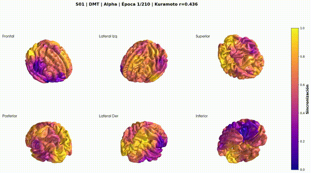
</p>

<h1 align="center">🧠 DMT Phase Synchronization Analysis</h1>

<p align="center">
  <strong>Pipeline completo de análisis de sincronización de fases en EEG durante estados alterados de consciencia inducidos por DMT</strong>
</p>

<p align="center">
  <a href="#-descripción">Descripción</a> •
  <a href="#-pipeline-principal">Pipeline</a> •
  <a href="#-visualizaciones">Visualizaciones</a> •
  <a href="#-machine-learning">Machine Learning</a> •
  <a href="#-quickstart">Quickstart</a>
</p>

---

## 📋 Descripción

Este proyecto analiza la **sincronización de fases** en señales EEG mediante **solución inversa** (source localization) para identificar correlaciones con experiencias subjetivas durante estados alterados de consciencia inducidos por **DMT** y compararlos con condiciones baseline (Eyes Closed - EC, Eyes Open - EO).

### Objetivos Principales

- 🎯 Calcular sincronización de fases entre canales EEG y fuentes corticales (100 parcelas de Schaefer)
- 📊 Determinar el **parámetro de orden de Kuramoto** como medida de coherencia global
- 🔗 Correlacionar patrones de sincronización con reportes subjetivos (ASC, MEQ, NDE)
- 🤖 Clasificar estados cerebrales usando **Graph Attention Networks** (GAT)
- 🎨 Generar visualizaciones dinámicas de la actividad cerebral

### Dataset

- **29 sujetos** válidos (de 35 totales)
- **3 condiciones**: DMT, Eyes Closed (EC), Eyes Open (EO)
- **~100-200 épocas** por sujeto
- **24 canales EEG** → **100 parcelas corticales** (source space)
- **5 bandas de frecuencia**: Delta, Theta, Alpha, Beta, Gamma

---

## 🏗️ Estructura del Proyecto

```
dmt_fz/
├── pipeline/                    # 🔧 Pipeline principal de análisis
│   ├── fwd.py                   # ⭐ PASO 1: Forward/Inverse + Sincronización
│   ├── calculate_syncro.py      # ⏱️ PASO 1b: Análisis temporal (opcional)
│   ├── multi2pool2.py           # 🔄 PASO 2a: Filtrado por redes cerebrales
│   ├── generate_order.py        # 📊 PASO 2b: Cálculo de Kuramoto
│   ├── build_order_data.py      # 📦 PASO 2c: Generar datos agregados
│   ├── pearson.py               # 🔗 PASO 3: Correlaciones
│   └── clustering.py            # 🎯 PASO 4: Estados cerebrales
│
├── viz_scripts/                 # 🎨 Visualizaciones
│   ├── plot.py                  # Entry point para frames/videos
│   ├── plot_order.py            # 📈 Visualización de Kuramoto
│   ├── plot_frames.py           # Generación de frames
│   └── plot_videos.py           # Generación de videos
│
├── machine_learning/            # 🤖 Machine Learning
│   └── clf/                     # GAT Classifier
│       ├── train.py             # Entrenamiento
│       ├── train_per_band.py    # Por banda de frecuencia
│       └── analysis/            # Análisis de attention
│
├── EEGNet/                      # 🧠 Deep Learning
├── spectral_sources/            # 🌲 Random Forest
└── docs/                        # 📚 Documentación técnica
```

---

## 🔬 Pipeline Principal de Análisis

### Diagrama de Flujo

```
┌─────────────────────────────────────────────────────────────────┐
│                    DATOS CRUDOS (.set files)                     │
│                  EEG_CLEAN/DMT/, EC/, EO/                        │
└─────────────────────────────────────────────────────────────────┘
                              │
                    ┌─────────▼─────────┐
                    │   fwd.py          │  ⭐ PASO 1
                    │ • Forward/Inverse │
                    │ • Hilbert         │
                    │ • Sincronización  │
                    │ • Kuramoto        │
                    └─────────┬─────────┘
                              │
              ┌───────────────┴───────────────┐
              │                               │
        phases-*.pkl                     extra.pkl
        (phases, amplitudes, syncros,
         kuramoto por banda)
              │
    ┌─────────┼─────────────────────────────────┐
    │         │                                 │
    │   ┌─────▼──────────┐               ┌──────▼───────────┐
    │   │calculate_syncro│               │ generate_order.py│
    │   │.py (opcional)  │               │                  │
    │   └─────┬──────────┘               └────────┬─────────┘
    │         │                                   │
    │   syncro-*.pkl                        order-*.pkl
    │   (análisis temporal)                       │
    │                                             │
┌───▼────────┐                                    │
│multi2pool2 │  ⭐ PASO 2                         │
│   .py      │                                    │
└───┬────────┘                                    │
    │                                             │
order_all-*.pkl                                   │
    │                                             │
    └──────────────────────┬──────────────────────┘
                           │
                ┌──────────▼──────────┐
                │ build_order_data.py │  📦 PASO 2c (opcional)
                │ --build-all         │
                └──────────┬──────────┘
                           │
                r_kuramoto_nets_*.pkl
                           │
    ┌──────────────────────┼──────────────────────┐
    │                      │                      │
┌───▼───┐            ┌─────▼─────┐          ┌─────▼─────┐
│pearson│  ⭐ PASO 3 │plot_order │          │clustering │  ⭐ PASO 4
│  .py  │            │   .py     │          │   .py     │
└───────┘            └───────────┘          └───────────┘
```

---

### ⭐ PASO 1: `fwd.py` - Procesamiento Completo de EEG

El corazón del proyecto. Realiza todo el procesamiento desde archivos `.set` hasta matrices de sincronización.

#### Proceso

1. **Forward/Inverse Solution**
   - Template `fsaverage` de MNE-Python
   - Boundary Element Method (BEM)
   - Método dSPM (SNR=3)
   - 100 parcelas de Schaefer (7 redes cerebrales)

2. **Filtrado por Bandas**
   ```python
   freq_bands = {
       "Delta": [1, 4],      # Hz
       "Theta": [4, 8],
       "Alpha": [8, 13],
       "Beta":  [13, 30],
       "Gamma": [30, 45]
   }
   ```

3. **Extracción de Fases (Hilbert)**
   ```python
   θ(t) = angle(hilbert(x(t)))  # Fase instantánea
   A(t) = |hilbert(x(t))|       # Amplitud envolvente
   ```

<p align="center">
  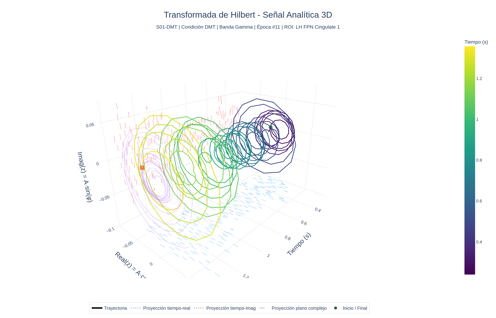
</p>

<p align="center"><em>Señal analítica 3D - Transformada de Hilbert mostrando la evolución temporal de fase y amplitud</em></p>

4. **Matriz de Sincronización**
   ```python
   S[i,j] = 1 - (Σ|Δθ(t)|) / (π·T)  # S ∈ [0,1]
   ```

5. **Parámetro de Kuramoto**
   ```python
   r(t) = |⟨e^(iθ)⟩|  # r ∈ [0,1]: 0=incoherente, 1=sincronizado
   ```

#### Comando

```bash
python pipeline/fwd.py --jobs 0 --workers 7 --conditions DMT EC EO
```

**Tiempo:** ~3-4 horas (29 sujetos, 7 workers)

#### 🎨 Visualizaciones disponibles después de este paso

Una vez generados los archivos `phases-*.pkl`, se pueden generar visualizaciones:

```bash
cd viz_scripts

# Frames de sincronización EEG + Source Space
python plot.py -s S01 -c DMT -b Alpha -m all --max-epochs 10

# Frames con tema oscuro y efectos glow
python plot.py -s S01 -c DMT -b Alpha -m advanced --max-epochs 10

# Videos animados
python plot.py -s S01 -c DMT -b Alpha -m video_advanced --max-epochs 5

# Cerebro 3D con rotación
python plot.py -s S01 -c DMT -b Alpha -m video_3d --max-epochs 5
```

---

### 🔄 PASO 2: Análisis por Redes Cerebrales

#### 2a. `multi2pool2.py` - Filtrado por Redes

Filtra las fases calculadas por las 7 redes funcionales del atlas de Schaefer:

| Red | Código | Descripción |
|-----|--------|-------------|
| 🎯 FPN | Frontoparietal | Control ejecutivo |
| 🧘 DMN | Default Mode | Mente en reposo |
| 👁️ DAN | Dorsal Attention | Atención dirigida |
| ⚡ SVA | Salience/Ventral | Detección de relevancia |
| 💚 LN | Limbic | Procesamiento emocional |
| 🖐️ SMN | Somatomotor | Control motor |
| 👀 VN | Visual | Procesamiento visual |

```bash
python pipeline/multi2pool2.py
```

#### 2b. `generate_order.py` - Cálculo del Order Parameter

Calcula el parámetro de Kuramoto para cada red y banda:

```bash
python pipeline/generate_order.py --workers 20 --conditions DMT EC EO
```

#### 2c. `build_order_data.py` - Generar Datos Agregados (Opcional)

Genera archivos `.pkl` con datos agregados que aceleran las visualizaciones y análisis:

```bash
# Generar r_kuramoto_nets_epochs_mean.pkl (requerido para algunos plots)
python pipeline/build_order_data.py --build-epochs-mean

# Generar r_kuramoto_nets_all_mean.pkl
python pipeline/build_order_data.py --build-all-mean

# Generar ambos
python pipeline/build_order_data.py --build-all
```

#### 🎨 Visualizaciones disponibles después de este paso

Con los archivos `order-*.pkl` generados:

```bash
cd viz_scripts

# Histogramas y comparaciones estadísticas de Kuramoto
python plot_order.py --workers 20

# Comparaciones específicas con menos sujetos (testing)
python plot_order.py --max-subjects 5
```

**Outputs en `plot_order_results/`:**
- Histogramas de Kuramoto por banda y red
- Trayectorias temporales del parámetro de orden
- Comparaciones DMT vs EC vs EO con tests estadísticos (FDR)

---

### 🔗 PASO 3: `pearson.py` - Correlaciones con Experiencia Subjetiva

Correlaciona medidas de sincronización con 23 escalas de cuestionarios subjetivos. Se analizan dos métricas principales:

- **Coherencia**: Media del parámetro de Kuramoto r (sincronización promedio)
- **Metastabilidad**: Varianza del parámetro r (fluctuaciones dinámicas)

**Cuestionarios analizados:**
- **ASC** (Altered States of Consciousness): Unity, Spiritual, Blissful, Insightfulness, Disembodiment, Impaired, Anxiety, Complex/Elementary imagery, Audiovisual, Changed
- **MEQ** (Mystical Experience): Mystical, Positive, Transcendental, Ineffability, Awe
- **NDE** (Near Death Experience): Cognition, Affect, Paranormal, Transcendental

```bash
python pipeline/pearson.py
```

#### Matrices de Correlación (Todas las Bandas × Redes)

<p align="center">
  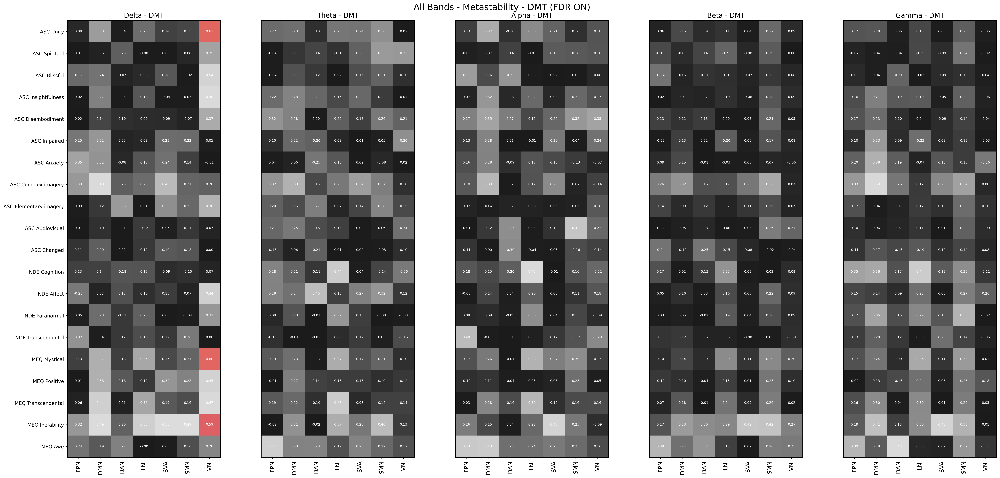
</p>

<p align="center"><em>Matriz de correlaciones de Metastabilidad (DMT) - 5 bandas × 7 redes × 19 escalas de cuestionarios. Valores significativos tras corrección FDR resaltados. Cada celda muestra el coeficiente r de Pearson entre la metastabilidad de una red en una banda específica y una escala del cuestionario.</em></p>

#### Ejemplo de Correlación Significativa

<p align="center">
  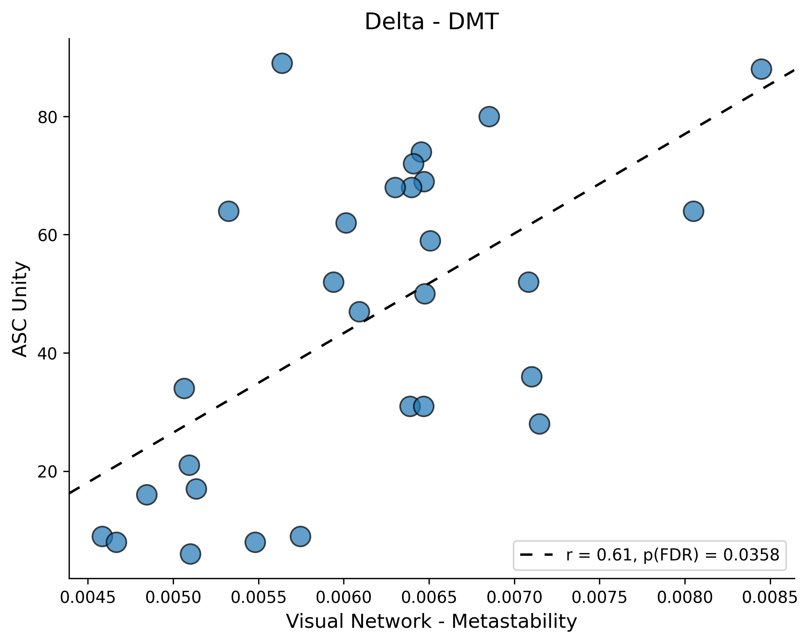
</p>

<p align="center"><em>Correlación entre Metastabilidad de la Red Visual (banda Delta) y la escala ASC Unity durante DMT. r = 0.606, indicando que mayor variabilidad en la sincronización visual se asocia con experiencias más intensas de unidad mística.</em></p>

#### Distribución del Parámetro de Kuramoto por Red y Banda

<p align="center">
  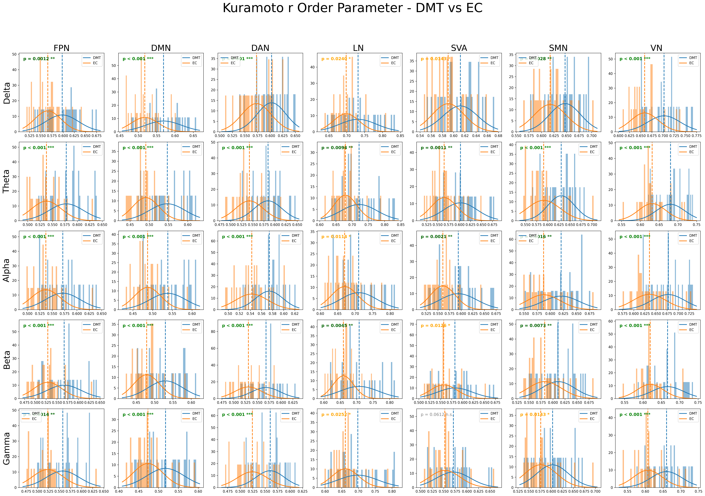
</p>

<p align="center"><em>Distribución del parámetro r de Kuramoto para DMT (azul) vs EC (naranja) en cada combinación de banda de frecuencia (filas) y red cerebral (columnas). Los p-values indican diferencias significativas entre condiciones. Se observa que DMT muestra patrones de sincronización distintos a Eyes Closed en múltiples redes, especialmente en DMN y FPN.</em></p>

**Outputs en `pearson_results/`:**
- Matrices de correlación (heatmaps)
- Scatter plots de correlaciones significativas
- Histogramas comparativos por condición

---

### 🎯 PASO 4: `clustering.py` - Estados Cerebrales

Identificación de estados cerebrales discretos mediante clustering.

```bash
python pipeline/clustering.py
```

**Tiempo:** ~2-4 horas

---

## 🎨 Visualizaciones

El módulo `viz_scripts/` genera visualizaciones dinámicas de la sincronización cerebral.

<p align="center">
  
</p>

<p align="center"><em>Visualización animada de sincronización EEG y Source Space - Tema oscuro con efectos glow</em></p>

### Vista Estática

<p align="center">
  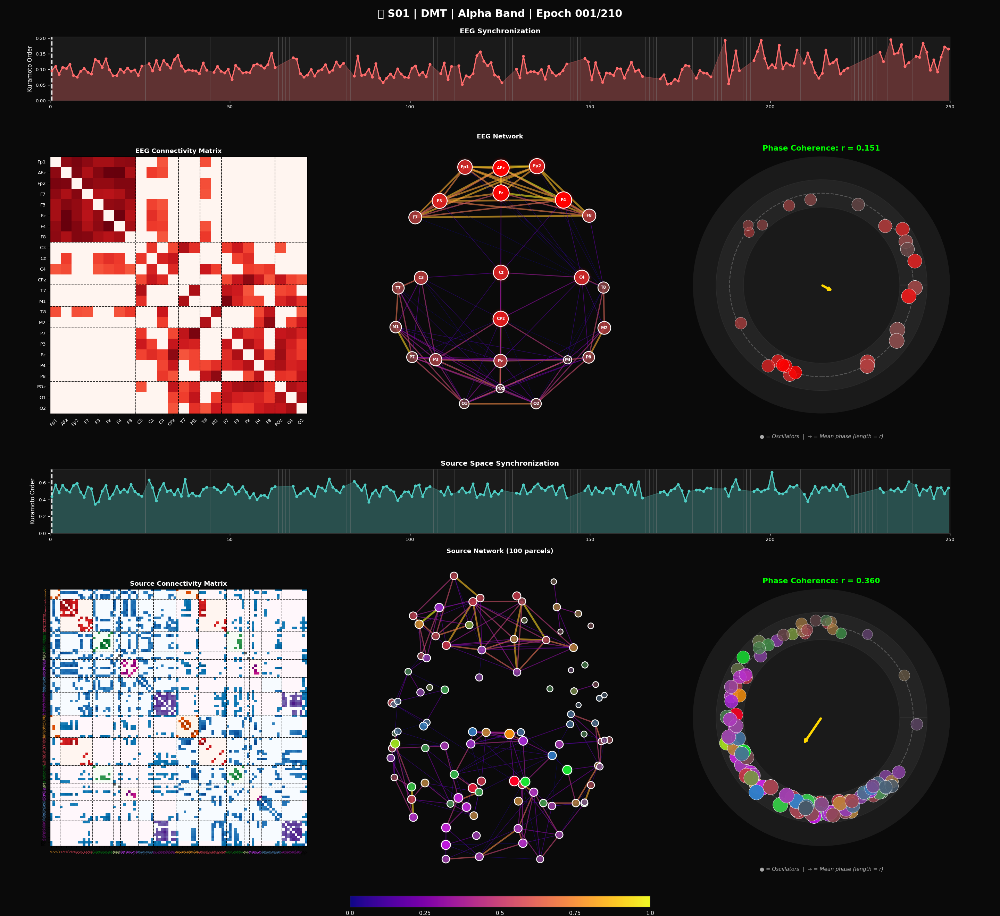
</p>

<p align="center"><em>Frame completo mostrando: Timeline Kuramoto, Matriz de conectividad, Grafo de red, Círculo de fases</em></p>

### Componentes de la Visualización

| Componente | Descripción | Interpretación |
|------------|-------------|----------------|
| 📈 Timeline Kuramoto | r(t) promedio por época | Alto = sincronización global |
| 🟥 Matriz | PLV entre canales/parcelas | Colores = fuerza de conexión |
| 🕸️ Grafo | Red de conectividad | Aristas = PLV > umbral |
| ⭕ Círculo de fases | Posición angular de osciladores | Agrupados = sincronizados |
| 🏹 Flecha dorada | Vector medio de fases | Longitud = r, dirección = fase media |

### Scripts Disponibles

| Script | Descripción | Requiere |
|--------|-------------|----------|
| `plot.py` | Frames y videos de sincronización | `phases-*.pkl` |
| `plot_order.py` | Histogramas y estadísticas de Kuramoto | `order-*.pkl`, `phases-*.pkl` |
| `visualize_brain_3d.py` | Cerebro 3D interpolado | `phases-*.pkl` |
| `visualize_results.py` | Estadísticas comparativas | `order-*.pkl` |

### Modos Disponibles

```bash
cd viz_scripts

# Frames básicos
python plot.py -s S01 -c DMT -b Alpha -m all --max-epochs 10

# Frames avanzados (tema oscuro, glow effects)
python plot.py -s S01 -c DMT -b Alpha -m advanced --max-epochs 10

# Video animado
python plot.py -s S01 -c DMT -b Alpha -m video_advanced --max-epochs 5

# Cerebro 3D con rotación
python plot.py -s S01 -c DMT -b Alpha -m video_3d --max-epochs 5

# Estadísticas de Kuramoto
python plot_order.py --workers 20
```

---

## 🤖 Machine Learning: GAT Classifier

Pipeline de clasificación de estados cerebrales (DMT vs EC) usando **Graph Attention Networks** sobre matrices de sincronización.

<p align="center">
  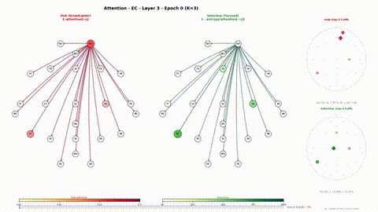
</p>

<p align="center"><em>Animación de attention weights del GAT durante clasificación</em></p>

### ¿Por qué GAT?

- ✅ Respeta la **estructura de grafo** de la conectividad cerebral
- ✅ Aprovecha las **matrices de sincronización** ya calculadas
- ✅ Los **attention weights** permiten interpretar qué conexiones discriminan
- ✅ Integra **parámetros de Kuramoto** como features globales

### Estructura del Grafo

<p align="center">
  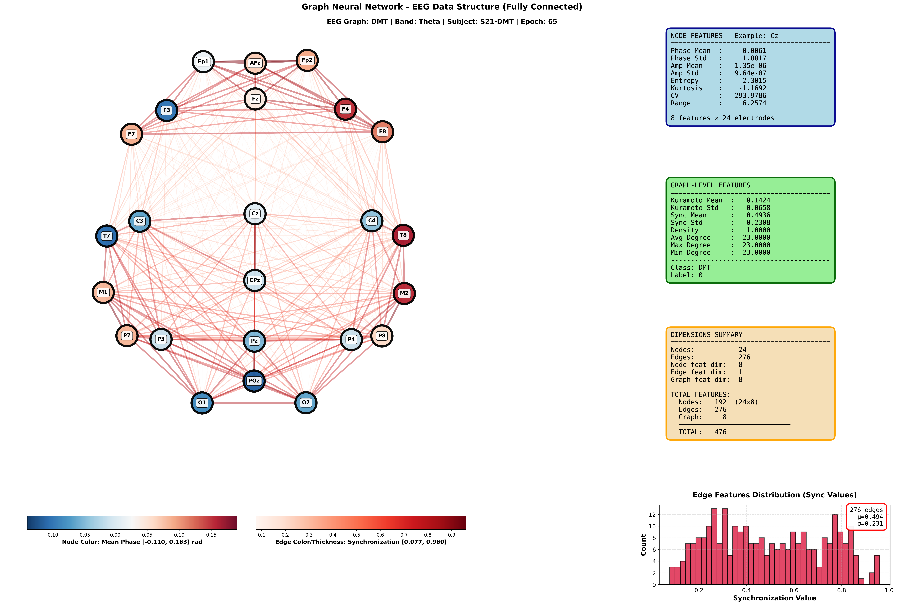
</p>

<p align="center"><em>Ejemplo de grafo EEG para condición DMT - 24 nodos (electrodos), 276 aristas (sincronización)</em></p>

<p align="center">
  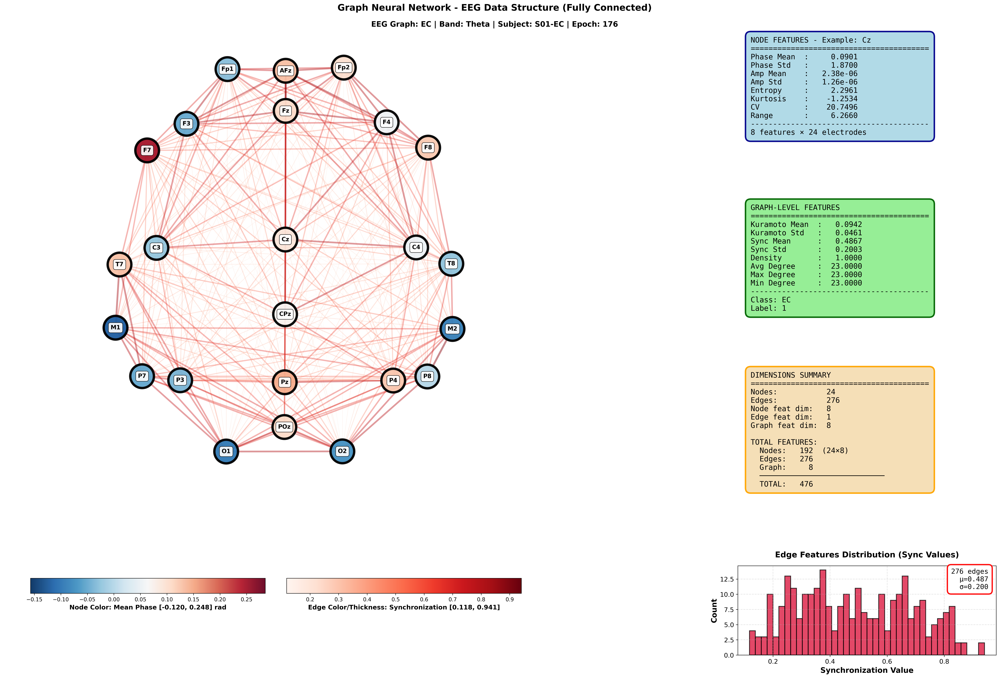
</p>

<p align="center"><em>Ejemplo de grafo EEG para condición EC (Eyes Closed) - baseline</em></p>

### Arquitectura

```
Época EEG → Grafo de Sincronización → GAT (4 layers, 8 heads) → Clasificador
```

**Features del modelo:**
- **Nodos**: 24 electrodos o 100 parcelas Schaefer
- **Node features**: Estadísticas de fase/amplitud (8 features)
- **Edge features**: Valores de sincronización
- **Graph features**: Kuramoto mean/std, métricas topológicas

### Resultados (Alpha Band)

<p align="center">
  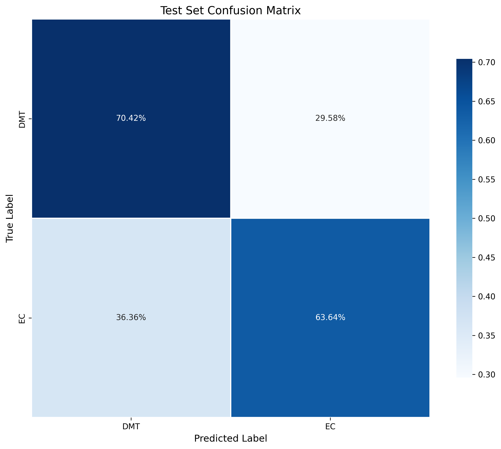
</p>

<p align="center"><em>Matriz de confusión del clasificador GAT - Test set</em></p>

| Métrica | Valor |
|---------|-------|
| **Test Accuracy** | 67.8% |
| **Balanced Accuracy** | 67.0% |
| **F1 Score (DMT)** | 72.8% |
| **F1 Score (EC)** | 60.5% |
| **Best Val Accuracy** | 81.6% |

<p align="center">
  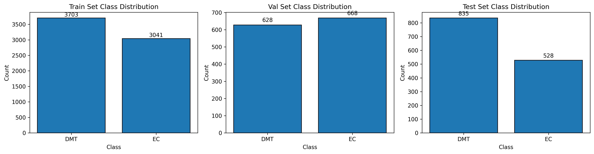
</p>

<p align="center"><em>Distribución de clases en train/val/test sets</em></p>

### Análisis de Attention

<p align="center">
  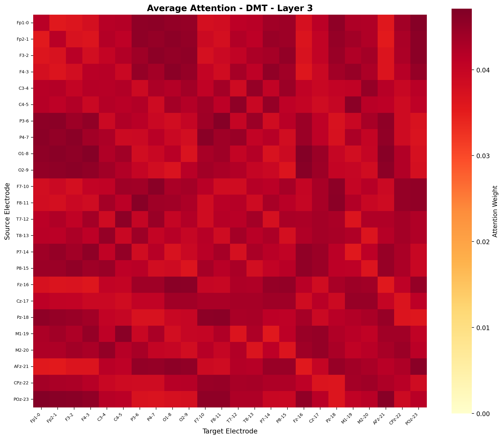
</p>

<p align="center"><em>Attention weights promedio para condición DMT - Layer 3</em></p>

<p align="center">
  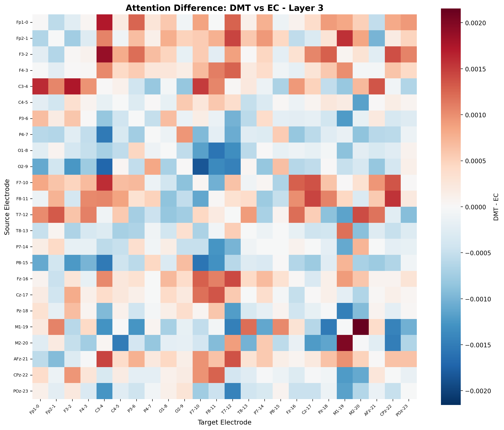
</p>

<p align="center"><em>Diferencia de attention entre DMT y EC - Identificación de conexiones discriminativas</em></p>

### Minimum Spanning Tree (MST)

<p align="center">
  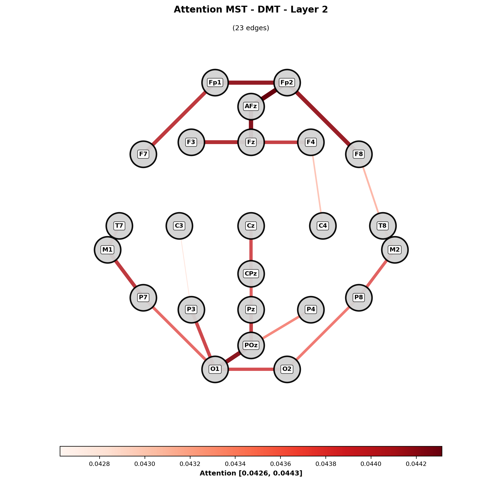
</p>

<p align="center"><em>Árbol de expansión mínima basado en attention weights - Layer 2</em></p>

### Comandos

```bash
cd machine_learning/clf

# Entrenamiento rápido (Alpha band)
./quick_train_alpha.sh

# Entrenamiento por banda (recomendado)
python train_per_band.py

# Búsqueda de hiperparámetros
python hyperparam_search.py --n_experiments 20 --bands Alpha --max_epochs 100

# Monitorear con TensorBoard
tensorboard --logdir=runs_alpha
```

---

## 🚀 Quickstart

### Requisitos

```bash
# Crear entorno
conda create -n dmt_fz python=3.10
conda activate dmt_fz

# Dependencias base
pip install mne numpy scipy matplotlib pandas
pip install scikit-learn sklearn-extra
pip install optuna tqdm pymatreader

# Para GAT Classifier
pip install torch torchvision --index-url https://download.pytorch.org/whl/cu118
pip install torch-geometric pyg_lib torch_scatter torch_sparse
```

### Pipeline Completo

```bash
cd /media/storage_hdd/dmt_fz

# ═══════════════════════════════════════════════════════════════════
# PASO 1: Procesar EEG (3-4 horas)
# ═══════════════════════════════════════════════════════════════════
python pipeline/fwd.py --jobs 0 --workers 7 --conditions DMT EC EO

# 🎨 Visualizaciones disponibles:
cd viz_scripts
python plot.py -s S01 -c DMT -b Alpha -m advanced --max-epochs 5
cd ..

# ═══════════════════════════════════════════════════════════════════
# PASO 2a: Filtrar por redes (2-5 min)
# ═══════════════════════════════════════════════════════════════════
python pipeline/multi2pool2.py

# ═══════════════════════════════════════════════════════════════════
# PASO 2b: Calcular order parameter (30 seg - 1 min)
# ═══════════════════════════════════════════════════════════════════
python pipeline/generate_order.py --workers 20 --conditions DMT EC EO

# ═══════════════════════════════════════════════════════════════════
# PASO 2c: Generar datos agregados (opcional, 2-5 min)
# ═══════════════════════════════════════════════════════════════════
python pipeline/build_order_data.py --build-all

# 🎨 Visualizaciones disponibles:
cd viz_scripts
python plot_order.py --workers 20
cd ..

# ═══════════════════════════════════════════════════════════════════
# PASO 3: Correlaciones (3-5 min)
# ═══════════════════════════════════════════════════════════════════
python pipeline/pearson.py

# 🎨 Outputs en pearson_results/

# ═══════════════════════════════════════════════════════════════════
# PASO 4: Clustering (opcional, 2-4 horas)
# ═══════════════════════════════════════════════════════════════════
python pipeline/clustering.py

# ═══════════════════════════════════════════════════════════════════
# Machine Learning: GAT Classifier
# ═══════════════════════════════════════════════════════════════════
cd machine_learning/clf
./quick_train_alpha.sh
```

### Pipeline Rápido (Testing)

```bash
# Solo 3 sujetos (~40 min total)
python pipeline/fwd.py --max-subjects 3 --workers 3 --conditions DMT
python pipeline/multi2pool2.py
python pipeline/generate_order.py --workers 10 --conditions DMT
python pipeline/build_order_data.py --build-epochs-mean

cd viz_scripts
python plot_order.py --max-subjects 3
```

---

## 📊 Tiempos de Ejecución

| Script | Descripción | Tiempo (29 sujetos) |
|--------|-------------|---------------------|
| `fwd.py` | Procesamiento principal | ~3-4 horas |
| `multi2pool2.py` | Filtrado por redes | ~2-5 min |
| `generate_order.py` | Kuramoto por red | ~30 seg - 1 min |
| `build_order_data.py` | Datos agregados | ~2-5 min |
| `pearson.py` | Correlaciones | ~3-5 min |
| `clustering.py` | Estados cerebrales | ~2-4 horas |
| **Total** | Pipeline completo | **~4-5 horas** |

---

## 📦 Archivos Generados

```
fwd-inv-stc/
├── DMT/, EC/, EO/
│   ├── phases-*.pkl         # [fwd.py] Fases, amplitudes, syncros, kuramoto
│   │                        # Contiene por banda: phases_eeg/stc,
│   │                        # amplitudes_eeg/stc, syncros_eeg/stc, kuramoto_eeg/stc
│   ├── syncro-*.pkl         # [calculate_syncro.py] Análisis temporal con splits
│   │                        # Sincronización y Kuramoto en ventanas temporales
│   ├── order_all-*.pkl      # [multi2pool2.py] DataFrames de fases por red
│   └── order-*.pkl          # [generate_order.py] Order parameter por red
├── extra.pkl                # [fwd.py] Metadata (labels, coordinates, mapping)
├── r_kuramoto_nets_epochs_mean.pkl  # [build_order_data.py] Datos agregados
└── r_kuramoto_nets_all_mean.pkl     # [build_order_data.py] Datos agregados

plot_order_results/          # Gráficos de Kuramoto (plot_order.py)
pearson_results/             # Matrices de correlación (pearson.py)
visualizations/              # Videos y frames (viz_scripts/)
```

---

## 🔬 Fundamentos Teóricos

### Parámetro de Orden de Kuramoto

```
r(t) = |1/N Σⱼ exp(iθⱼ(t))|

donde:
- θⱼ(t): fase del oscilador j en tiempo t
- N: número de osciladores
- r ∈ [0,1]: 0=desincronizado, 1=perfectamente sincronizado
```

### Matriz de Sincronización

```
S[i,j] = 1 - (1/(π·T)) Σₜ |Δθᵢⱼ(t)|

donde:
- Δθᵢⱼ(t): diferencia angular entre señales i y j
- S[i,j] ∈ [0,1]: 0=desincronización, 1=sincronización perfecta
```

### Redes de Schaefer (Atlas 100 parcelas)

Parcelas del atlas Schaefer2018 organizadas en 7 redes funcionales basadas en conectividad intrínseca del Human Connectome Project.

---

## 📚 Documentación Adicional

- 📖 [QUICKSTART.md](docs/QUICKSTART.md) - Guía rápida para empezar
- 📋 [WORKFLOW.md](docs/WORKFLOW.md) - Pipeline detallado paso a paso
- 🔬 [TECHNICAL_DETAILS.md](docs/TECHNICAL_DETAILS.md) - Detalles matemáticos
- 🤖 [GAT Classifier README](machine_learning/clf/docs/README.md) - Documentación del clasificador
- 🎨 [Visualizations README](viz_scripts/README.md) - Guía de visualizaciones

---

## 🛠️ Troubleshooting

| Problema | Solución |
|----------|----------|
| `ModuleNotFoundError: pandas.core.indexes.numeric` | Archivos .pkl de pandas antiguo - ya manejado automáticamente |
| `CUDA out of memory` | Reducir `batch_size` a 16 o 8 |
| `No graphs were created` | Verificar `phases_dir` en config |
| `ValueError: operands could not be broadcast` | Ejecutar `generate_order.py` |

---

## 📄 Referencias

### Publicación Principal

> **Pallavicini, C., Cavanna, F., Zamberlan, F., de la Fuente, L. A., Ilksoy, Y., Perl, Y. S., Arias, M., Romero, C., Carhart-Harris, R., Timmermann, C., & Tagliazucchi, E.** (2021). *Neural and subjective effects of inhaled N,N-dimethyltryptamine in natural settings*. Journal of Psychopharmacology, 35(4), 406-420. https://doi.org/10.1177/0269881120981384

### Referencias Técnicas

1. **Kuramoto Model:** Kuramoto, Y. (1975). Self-entrainment of a population of coupled non-linear oscillators.
2. **Source Localization:** Dale et al. (2000). Dynamic statistical parametric mapping.
3. **Schaefer Atlas:** Schaefer et al. (2018). Local-global parcellation of the human cerebral cortex.
4. **GAT:** Veličković et al. (2018). Graph Attention Networks. ICLR.
5. **GATv2:** Brody et al. (2021). How Attentive are Graph Attention Networks?
6. **MNE-Python:** Gramfort et al. (2014). MNE software for processing MEG and EEG data.

---

<p align="center">
  <strong>🧠 DMT Phase Synchronization Analysis</strong><br>
  <em>Explorando la consciencia a través de la sincronización cerebral</em>
</p>
