# EEG Viewer - Guía de la Interfaz

> **Suite completa de procesamiento y visualización de EEG**

Una aplicación web modular para visualización de datos EEG, preprocesamiento, ejecución de pipelines y análisis de redes neuronales. Construida con [NiceGUI](https://nicegui.io/) y [MNE-Python](https://mne.tools/).

---

## Tabla de Contenidos

- [EEG Viewer - Guía de la Interfaz](#eeg-viewer---guía-de-la-interfaz)
  - [Tabla de Contenidos](#tabla-de-contenidos)
  - [Resumen General](#resumen-general)
    - [Formatos Soportados](#formatos-soportados)
  - [Instalación Rápida](#instalación-rápida)
  - [Viewer - Visualización Interactiva](#viewer---visualización-interactiva)
    - [Vista General](#vista-general)
    - [File Browser y Carga de Archivos](#file-browser-y-carga-de-archivos)
      - [Características](#características)
      - [Cómo Cargar un Archivo](#cómo-cargar-un-archivo)
      - [Formatos Soportados](#formatos-soportados-1)
    - [Filtros y Selección de Canales](#filtros-y-selección-de-canales)
      - [Controles de Filtrado](#controles-de-filtrado)
      - [Selección de Canales](#selección-de-canales)
    - [Visualizaciones y Análisis](#visualizaciones-y-análisis)
      - [Gráficos EEG](#gráficos-eeg)
      - [Navegación Temporal](#navegación-temporal)
      - [Topografía Cerebral (TOPO)](#topografía-cerebral-topo)
      - [Análisis FFT](#análisis-fft)
      - [Transformada de Hilbert](#transformada-de-hilbert)
    - [Modo Comparación](#modo-comparación)
      - [Cómo Activar el Modo Comparación](#cómo-activar-el-modo-comparación)
      - [Visualización Dual](#visualización-dual)
    - [Gráficos de Diferencia](#gráficos-de-diferencia)
      - [FFT DIFF (Diferencia Espectral)](#fft-diff-diferencia-espectral)
      - [HILBERT DIFF (Diferencia de Envolvente y Fase)](#hilbert-diff-diferencia-de-envolvente-y-fase)
      - [Código de Colores](#código-de-colores)
      - [Controles del Modo Comparación](#controles-del-modo-comparación)
    - [Generación de Epochs (Dataset)](#generación-de-epochs-dataset)
      - [Parámetros](#parámetros)
      - [Proceso de Generación](#proceso-de-generación)
      - [Archivos de Salida](#archivos-de-salida)
    - [Demo Completa](#demo-completa)
  - [Cleaner - Pipeline de Preprocesamiento](#cleaner---pipeline-de-preprocesamiento)
    - [Flujo del Pipeline](#flujo-del-pipeline)
    - [Características Generales](#características-generales)
    - [1. Load - Carga de Archivos](#1-load---carga-de-archivos)
      - [Formatos Soportados](#formatos-soportados-2)
      - [Información Mostrada](#información-mostrada)
    - [2. Filter - Filtrado](#2-filter---filtrado)
      - [Presets Disponibles](#presets-disponibles)
    - [3. Bad Channels - Canales Problemáticos](#3-bad-channels---canales-problemáticos)
      - [Detección Automática](#detección-automática)
      - [Acciones](#acciones)
    - [4. Rereference - Re-referenciado](#4-rereference---re-referenciado)
      - [Tipos de Referencia](#tipos-de-referencia)
    - [5. ICA - Análisis de Componentes](#5-ica---análisis-de-componentes)
      - [Proceso](#proceso)
      - [Visualizaciones](#visualizaciones)
    - [6. Epochs - Segmentación](#6-epochs---segmentación)
      - [Parámetros](#parámetros-1)
    - [7. Reject - Rechazo de Épocas](#7-reject---rechazo-de-épocas)
      - [Criterios de Rechazo](#criterios-de-rechazo)
    - [8. Visualize - Visualización Final](#8-visualize---visualización-final)
      - [Vistas Disponibles](#vistas-disponibles)
    - [9. Export - Exportación](#9-export---exportación)
      - [Formatos de Exportación](#formatos-de-exportación)
      - [Archivos Adicionales](#archivos-adicionales)
  - [Pipeline - Procesamiento Batch](#pipeline---procesamiento-batch)
    - [Layout](#layout)
    - [Configuración I/O](#configuración-io)
    - [Parámetros Globales](#parámetros-globales)
    - [Fase 1: Modelo Forward](#fase-1-modelo-forward)
      - [Step 1: Forward Model (`fwd.py`)](#step-1-forward-model-fwdpy)
      - [Step 2: Consolidate (`save_load_pickle.py`)](#step-2-consolidate-save_load_picklepy)
    - [Fase 2: Análisis de Red](#fase-2-análisis-de-red)
      - [Step 3: Network Filter (`multi2pool2.py`)](#step-3-network-filter-multi2pool2py)
      - [Step 4: Synchronization (`calculate_syncro.py`)](#step-4-synchronization-calculate_syncropy)
      - [Step 5: Order Parameter (`generate_order.py`)](#step-5-order-parameter-generate_orderpy)
      - [Step 6: Aggregate (`build_order_data.py`)](#step-6-aggregate-build_order_datapy)
    - [Fase 3: Análisis Estadístico](#fase-3-análisis-estadístico)
      - [Step 7: Pearson (`pearson.py`)](#step-7-pearson-pearsonpy)
      - [Step 8: Clustering (`clustering.py`)](#step-8-clustering-clusteringpy)
    - [Panel de Visualización](#panel-de-visualización)
      - [Pestañas de Visualización](#pestañas-de-visualización)
    - [Consola de Salida](#consola-de-salida)
      - [Características](#características-1)
    - [Generador de Animaciones](#generador-de-animaciones)
      - [Parámetros](#parámetros-2)
  - [Model - Entrenamiento de Redes Neuronales](#model---entrenamiento-de-redes-neuronales)
    - [Dataset Scanner](#dataset-scanner)
      - [Tipos Detectados](#tipos-detectados)
      - [Información Mostrada](#información-mostrada-1)
    - [Configuración del Modelo](#configuración-del-modelo)
      - [Arquitectura](#arquitectura)
      - [Entrenamiento](#entrenamiento)
    - [Controles de Entrenamiento](#controles-de-entrenamiento)
    - [Visualización de Arquitectura](#visualización-de-arquitectura)
    - [Métricas de Entrenamiento](#métricas-de-entrenamiento)
      - [Métricas Mostradas](#métricas-mostradas)
    - [Calidad de Reconstrucción](#calidad-de-reconstrucción)
      - [Paneles](#paneles)
      - [Métricas](#métricas)
  - [Analysis - Exploración de Modelos](#analysis---exploración-de-modelos)
    - [Carga de Modelos](#carga-de-modelos)
      - [Información Mostrada](#información-mostrada-2)
    - [Espacio Latente PCA](#espacio-latente-pca)
      - [Características](#características-2)
    - [Activaciones por Capa](#activaciones-por-capa)
      - [Capas Disponibles](#capas-disponibles)
    - [Pesos de Atención](#pesos-de-atención)
      - [Visualización](#visualización)
  - [Navegación Global](#navegación-global)
    - [Header y Monitor de Sistema](#header-y-monitor-de-sistema)
      - [Componentes](#componentes)
    - [Barra de Navegación](#barra-de-navegación)
    - [Atajos de Teclado](#atajos-de-teclado)
  - [Solución de Problemas](#solución-de-problemas)
    - [Problemas Comunes](#problemas-comunes)
      - ["No module named 'mne'"](#no-module-named-mne)
      - ["File not found"](#file-not-found)
      - ["Port 8080 already in use"](#port-8080-already-in-use)
      - [ICA muy lento](#ica-muy-lento)
      - [Memoria insuficiente](#memoria-insuficiente)
  - [Contribución](#contribución)

---

## Resumen General

EEG Viewer es una aplicación multi-página que proporciona un flujo de trabajo completo para el análisis de señales EEG:

| Página | URL | Propósito |
|--------|-----|-----------|
| **Viewer** | `/` | Visualización interactiva con comparación dual |
| **Cleaner** | `/cleaner` | Pipeline de preprocesamiento paso a paso |
| **Pipeline** | `/pipeline` | Procesamiento batch y localización de fuentes |
| **Model** | `/model` | Entrenamiento de redes neuronales (VAE/GNN) |
| **Analysis** | `/analysis` | Inspección de modelos y exploración del espacio latente |

### Formatos Soportados

- **BDF** - BioSemi (formato principal)
- **EDF** - European Data Format
- **SET** - EEGLAB
- **FIF** - Formato nativo de MNE

---

## Instalación Rápida

```bash
# Linux/macOS
cd eeg_viewer
chmod +x run.sh
./run.sh

# Windows
cd eeg_viewer
run.bat
```

Después de iniciar, abre tu navegador en: `http://localhost:8080`

---

## Viewer - Visualización Interactiva

La página principal del Viewer (`/`) permite explorar archivos EEG con visualizaciones en tiempo real y la posibilidad de comparar dos archivos simultáneamente.

### Vista General

<p align="center">
  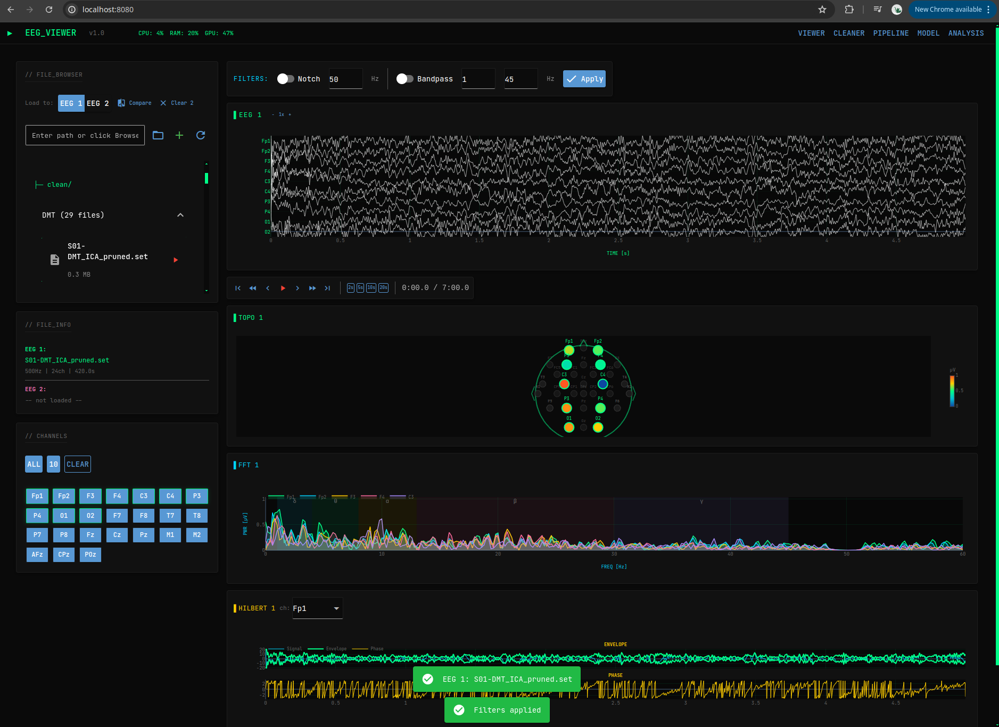
</p>

La interfaz está dividida en dos áreas principales:

**Panel Izquierdo (Sidebar):**
- **FILE_BROWSER**: Navegación y carga de archivos EEG
- **FILE_INFO**: Información del archivo cargado (frecuencia, canales, duración)
- **CHANNELS**: Selección de canales a visualizar

**Panel Principal (Derecha):**
- **FILTERS**: Controles de filtrado (Notch, Bandpass)
- **EEG**: Visualización de señales multi-canal
- **Navigation**: Controles de reproducción y navegación temporal
- **TOPO**: Mapas topográficos de actividad cerebral
- **FFT**: Análisis espectral de potencia
- **HILBERT**: Transformada de Hilbert (envolvente y fase)
- **DATASET**: Generación y exportación de épocas

---

### File Browser y Carga de Archivos

El panel de **FILE_BROWSER** permite navegar y cargar archivos EEG de forma rápida.

#### Características

| Función | Descripción |
|---------|-------------|
| **Auto-descubrimiento** | Escanea automáticamente las carpetas `EEG/` y `EEG_CLEAN/` |
| **Organización** | Los archivos se agrupan por condición (DMT, EC, EO, etc.) |
| **Carga rápida** | Click en ▶ para cargar instantáneamente |
| **Rutas personalizadas** | Añade directorios adicionales con el input de ruta |
| **Dual loading** | Selector "Load to:" para elegir EEG 1 o EEG 2 |

#### Cómo Cargar un Archivo

1. Los archivos aparecen agrupados por carpeta (`raw/`, `clean/`)
2. Expande una condición para ver los archivos disponibles
3. Haz click en el botón ▶ junto al archivo para cargarlo
4. El panel **FILE_INFO** mostrará: frecuencia de muestreo, número de canales y duración

#### Formatos Soportados

- **BDF** - BioSemi Data Format (formato principal)
- **EDF** - European Data Format
- **SET** - EEGLAB
- **FIF** - MNE Native Format

---

### Filtros y Selección de Canales

<p align="center">
  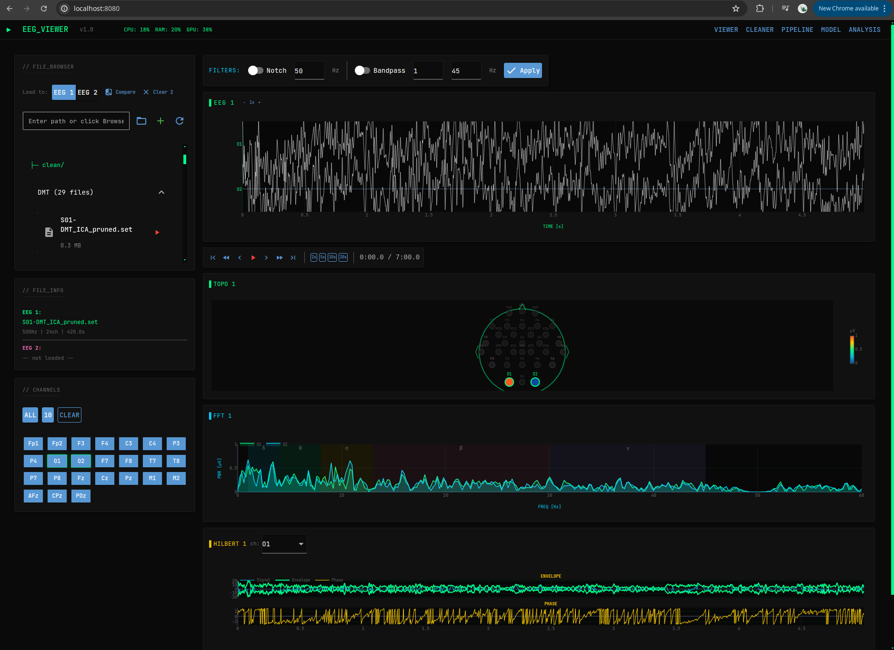
</p>

#### Controles de Filtrado

Los filtros se aplican en tiempo real a todas las visualizaciones.

| Filtro | Descripción | Valores Típicos |
|--------|-------------|-----------------|
| **Notch** | Elimina ruido de línea eléctrica | 50 Hz (Europa), 60 Hz (América) |
| **Bandpass** | Aísla frecuencias de interés EEG | 1-45 Hz (estándar) |

**Cómo usar:**
1. Activa el switch del filtro deseado
2. Ajusta los valores según necesidad
3. Click en **Apply** para ver los cambios

#### Selección de Canales

El panel **CHANNELS** permite elegir qué electrodos visualizar:

| Botón | Acción |
|-------|--------|
| **ALL** | Selecciona todos los canales EEG |
| **10** | Selecciona los primeros 10 canales |
| **CLEAR** | Deselecciona todos los canales |

Los canales seleccionados se muestran en todos los gráficos (EEG, FFT, Topografía).

---

### Visualizaciones y Análisis

#### Gráficos EEG

Visualización de señales multi-canal con auto-escalado inteligente:

- **Colores distintivos**: Cada canal tiene un color único
- **Normalización**: Las señales se normalizan para evitar superposición
- **Hover info**: Pasa el mouse sobre una traza para ver el valor exacto en µV

**Controles de Escala:**

| Botón | Acción |
|-------|--------|
| `-` | Reduce la separación entre canales |
| `1x` | Restaura la escala por defecto |
| `+` | Aumenta la separación entre canales |

#### Navegación Temporal

| Icono | Acción | Atajo de Teclado |
|-------|--------|------------------|
| `⏮` | Ir al inicio | `Home` |
| `⏪` | Reproducir hacia atrás | - |
| `◀` | Segmento anterior | `←` |
| `▶` | Play/Pause | `Space` |
| `▶` | Segmento siguiente | `→` |
| `⏩` | Avance rápido (4x) | - |
| `⏭` | Ir al final | `End` |

**Duración de Ventana:** Botones `2s`, `5s`, `10s`, `20s` para ajustar cuántos segundos mostrar.

#### Topografía Cerebral (TOPO)

Mapa topográfico que muestra la actividad por electrodo usando el sistema 10-20:
- **Escala de color**: Azul (baja) → Verde → Amarillo → Rojo (alta actividad)
- **Electrodos activos**: Se muestran resaltados con valores en µV
- **Electrodos inactivos**: Aparecen atenuados

#### Análisis FFT

Espectro de potencia con bandas de frecuencia anotadas:

| Banda | Rango (Hz) | Asociación |
|-------|------------|------------|
| **δ** Delta | 1-4 | Sueño profundo |
| **θ** Theta | 4-8 | Relajación, meditación |
| **α** Alpha | 8-13 | Vigilia relajada |
| **β** Beta | 13-30 | Actividad cognitiva |
| **γ** Gamma | 30-45 | Procesamiento alto |

#### Transformada de Hilbert

Análisis de amplitud instantánea y fase:
- **ENVELOPE**: Señal original con envolvente superpuesta
- **PHASE**: Fase instantánea (-π a +π)
- **Selector de canal**: Dropdown para elegir qué canal analizar

---

### Modo Comparación

<p align="center">
  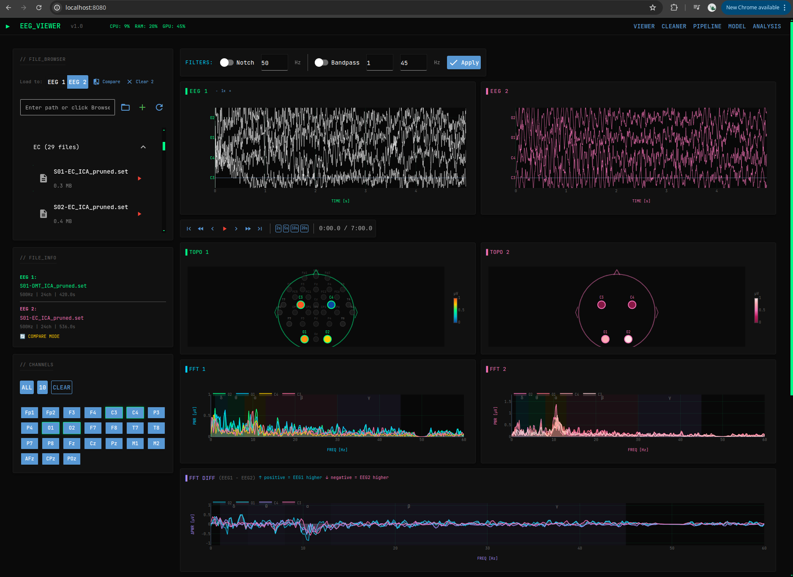
</p>

El modo comparación permite visualizar **dos archivos EEG lado a lado** para análisis comparativo.

#### Cómo Activar el Modo Comparación

1. Carga un archivo en **EEG 1** (por defecto)
2. Cambia el selector "Load to:" a **EEG 2**
3. Carga un segundo archivo
4. Click en el botón **Compare** para activar el modo dual

#### Visualización Dual

En modo comparación, todos los gráficos se duplican:
- **EEG 1** (verde) | **EEG 2** (rosa)
- **TOPO 1** | **TOPO 2**
- **FFT 1** | **FFT 2**
- **HILBERT 1** | **HILBERT 2**

Ambos EEGs comparten la misma posición temporal y navegación sincronizada.

---

### Gráficos de Diferencia

<p align="center">
  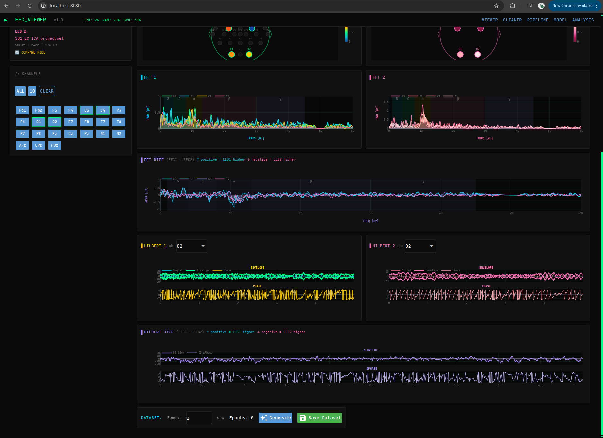
</p>

Además de la visualización dual, el modo comparación incluye **gráficos de diferencia** que muestran la resta entre ambos EEGs:

#### FFT DIFF (Diferencia Espectral)

Muestra `EEG1 - EEG2` en el dominio de frecuencia:
- **Valores positivos** (arriba de cero): EEG 1 tiene mayor potencia
- **Valores negativos** (debajo de cero): EEG 2 tiene mayor potencia

#### HILBERT DIFF (Diferencia de Envolvente y Fase)

- **ΔENVELOPE**: Diferencia de amplitud instantánea
- **ΔPHASE**: Diferencia de fase (wraped a [-π, π])

#### Código de Colores

| Color | Significado |
|-------|-------------|
| **Cyan / Positivo** | EEG 1 tiene mayor actividad |
| **Rosa / Negativo** | EEG 2 tiene mayor actividad |
| **Púrpura** | Línea de diferencia |

#### Controles del Modo Comparación

| Botón | Acción |
|-------|--------|
| **Compare** | Activa/desactiva el modo comparación |
| **Clear 2** | Descarga EEG 2 y desactiva comparación |

---

### Generación de Epochs (Dataset)

El panel **DATASET** en la parte inferior permite segmentar el registro en épocas para análisis posterior o entrenamiento de modelos.

#### Parámetros

| Campo | Descripción | Rango |
|-------|-------------|-------|
| **Epoch** | Duración de cada época | 0.5 - 30 segundos |

#### Proceso de Generación

1. Ajusta la duración de las épocas en segundos
2. Click en **Generate** para crear las épocas
3. El contador mostrará cuántas épocas se generaron
4. Click en **Save Dataset** para exportar

#### Archivos de Salida

Los archivos se guardan en `epochs_output/` dentro del directorio del archivo original:

| Archivo | Contenido |
|---------|-----------|
| `{nombre}_epochs_{timestamp}.npy` | Datos crudos de cada época |
| `{nombre}_fft_{timestamp}.npy` | FFT calculado para cada época |
| `{nombre}_meta_{timestamp}.csv` | Metadatos (archivo, sfreq, n_epochs, duración) |

---

### Demo Completa

<p align="center">
  
</p>

El GIF anterior muestra un flujo de trabajo típico en el Viewer:
1. Carga de archivo EEG
2. Aplicación de filtros
3. Navegación temporal
4. Activación del modo comparación
5. Visualización de diferencias

---

## Cleaner - Pipeline de Preprocesamiento

La página Cleaner (`/cleaner`) proporciona un pipeline de limpieza y preprocesamiento de EEG con 8 pasos.

### Vista General

<p align="center">
  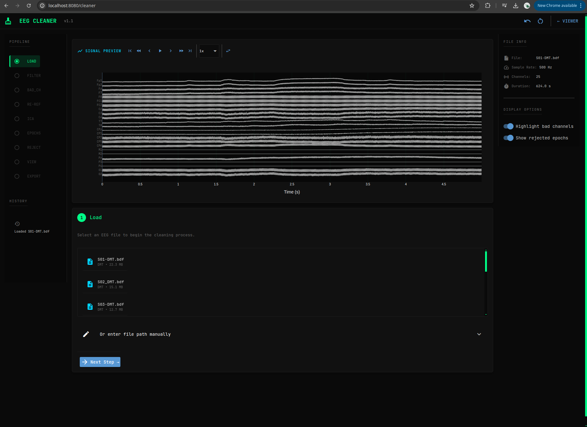
</p>

**Panel Izquierdo:** Steps con indicadores de estado, navegación Previous/Next, información del archivo.

**Panel Principal:** Controles del paso actual, visualización EEG en tiempo real, estadísticas.

### Flujo del Pipeline

```
LOAD → FILTER → BAD_CHANNELS → REREFERENCE → ICA → EPOCHS → REJECT → EXPORT
```

### Características

- **Undo/Redo** en cada paso
- **Indicadores** de pasos completados (✓)
- **Navegación libre** entre pasos

---

### 1. Load

Carga el archivo EEG a procesar. Formatos soportados: `.bdf`, `.edf`, `.set`, `.fif`

Al cargar se muestra: frecuencia de muestreo, número de canales, duración y tipos de canales.

---

### 2. Filter

<p align="center">
  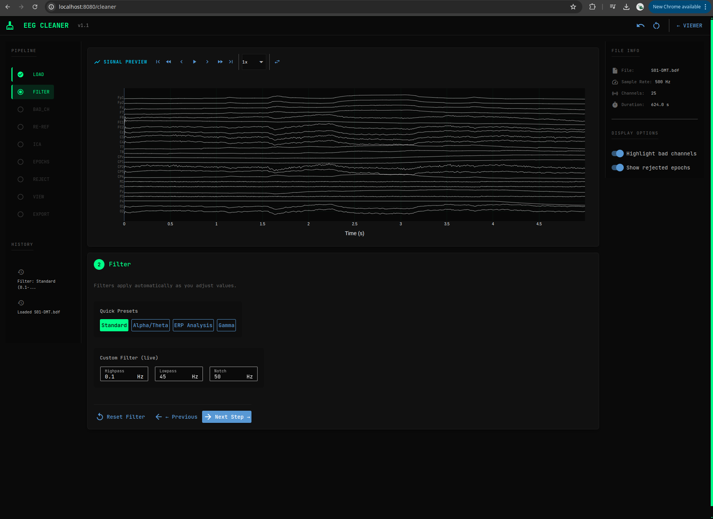
</p>

Aplica filtros para limpiar la señal.

| Preset | Highpass | Lowpass | Notch |
|--------|----------|---------|-------|
| **Standard** | 0.1 Hz | 45 Hz | 50 Hz |
| **Research** | 1 Hz | 40 Hz | 50 Hz |
| **Clinical** | 0.5 Hz | 70 Hz | 50/60 Hz |
| **Custom** | Manual | Manual | Manual |

---

### 3. Bad Channels

<p align="center">
  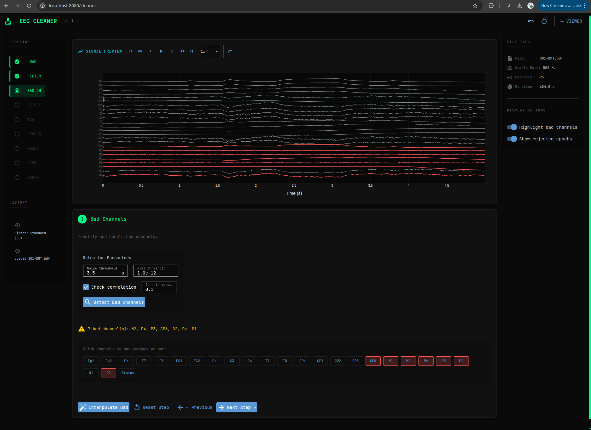
</p>

Detecta e interpola canales defectuosos.

| Tipo | Criterio |
|------|----------|
| **Flat** | Varianza < umbral |
| **Noisy** | Varianza > umbral |
| **Uncorrelated** | Baja correlación con vecinos |

**Acciones:** Auto Detect → Manual Select → Interpolate

---

### 4. Rereference

<p align="center">
  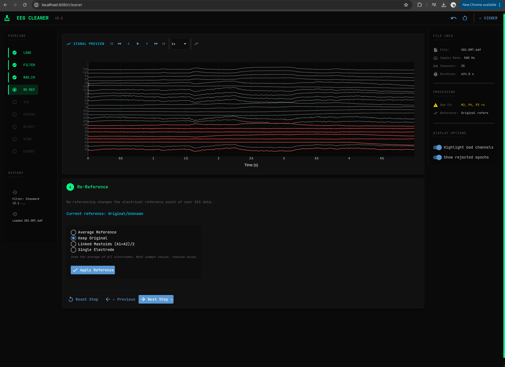
</p>

Cambia la referencia de los canales EEG.

| Tipo | Descripción |
|------|-------------|
| **Average** | Promedio de todos los canales |
| **Linked Mastoids** | Promedio de M1 y M2 |
| **Single Electrode** | Un electrodo (ej: Cz) |
| **REST** | Referencia infinita estimada |

---

### 5. ICA

<p align="center">
  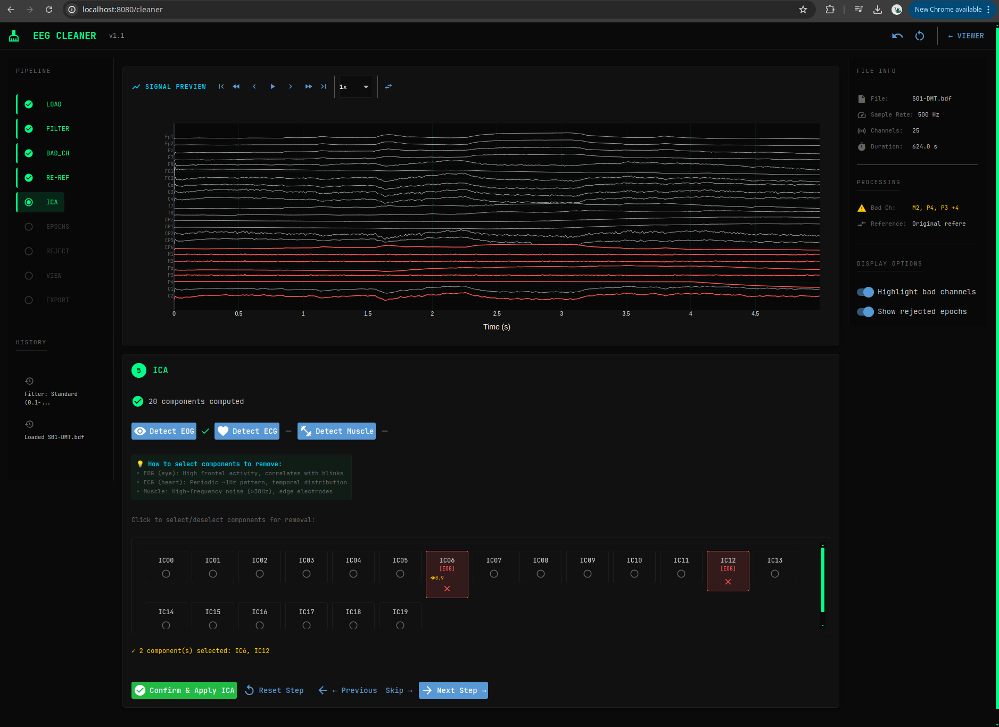
</p>

Análisis de Componentes Independientes para eliminar artefactos (EOG, ECG, movimientos).

**Proceso:** Compute ICA → Auto Detect → Manual Review → Exclude → Apply

**Visualizaciones:** Topografía, serie temporal, espectro, correlación con EOG/ECG.

---

### 6. Epochs

<p align="center">
  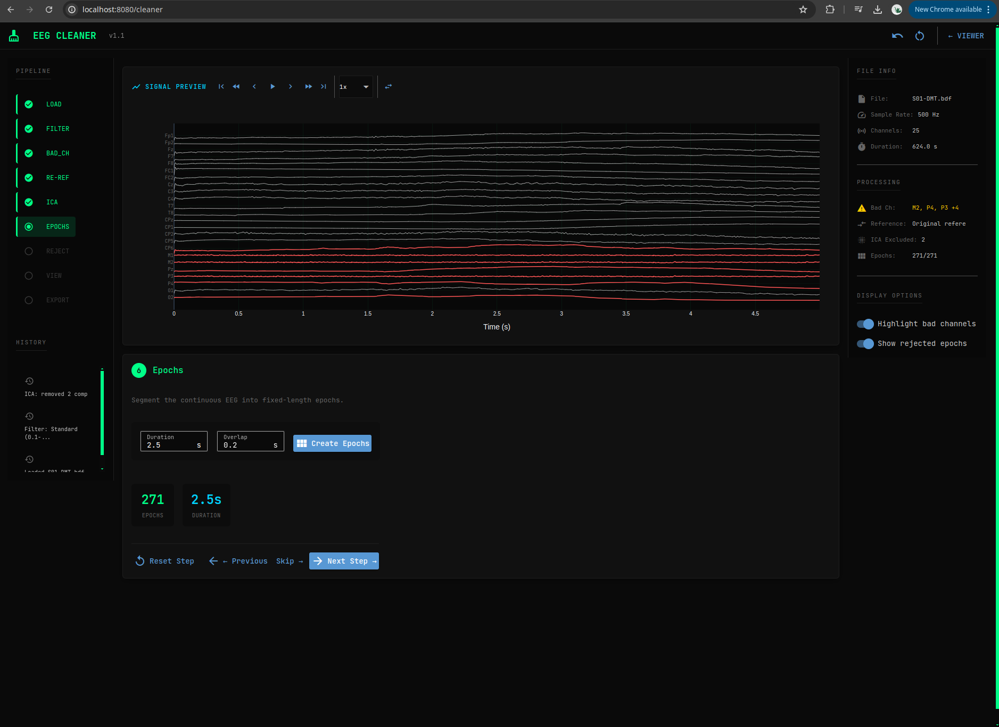
</p>

Divide el registro en segmentos de longitud fija.

| Parámetro | Descripción |
|-----------|-------------|
| **Duration** | Longitud de cada época (1-5 seg) |
| **Overlap** | Solapamiento entre épocas (0-50%) |

---

### 7. Reject

<p align="center">
  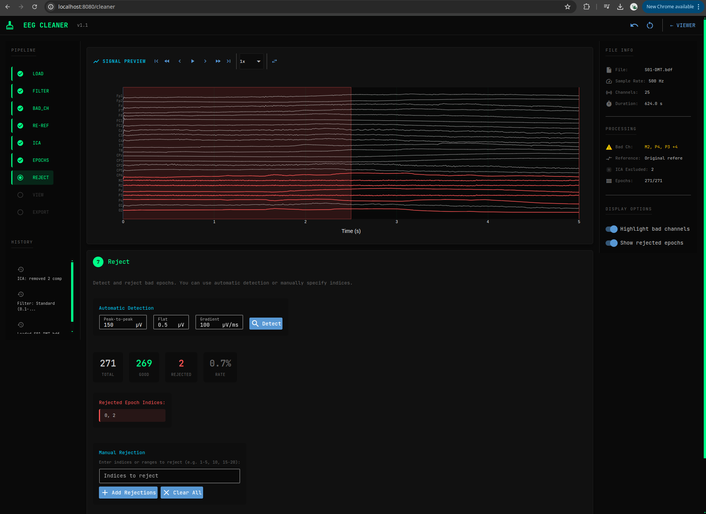
</p>

Elimina épocas con artefactos según criterios de amplitud.

| Criterio | Valor Típico |
|----------|--------------|
| **Peak-to-peak** | 100-200 µV |
| **Flat** | 0.5 µV |
| **Gradient** | 50-100 µV/ms |

---

### 8. Export

<p align="center">
  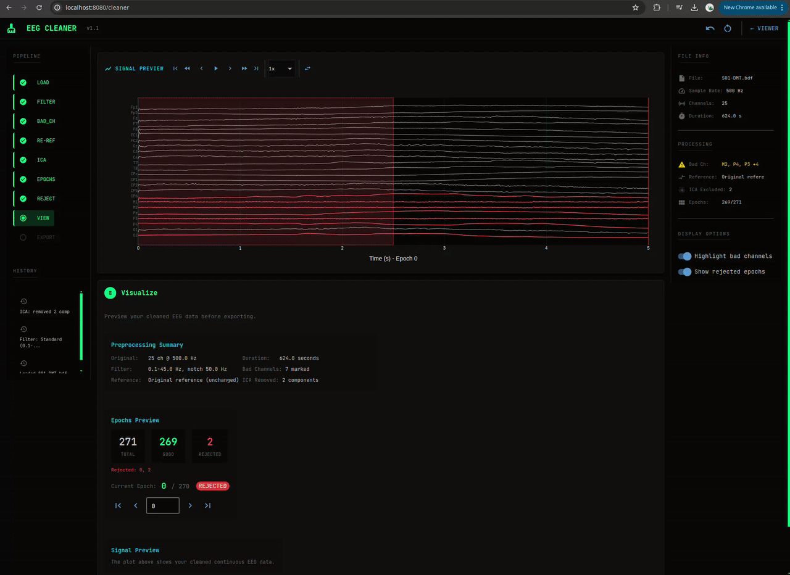
</p>

Exporta los datos procesados.

**Formatos:** FIF (recomendado), SET, EDF, NPY, CSV

**Archivos adicionales:** `preprocessing_log.json`, `bad_channels.txt`, `ica_excluded.txt`

---

### Resultados

<p align="center">
  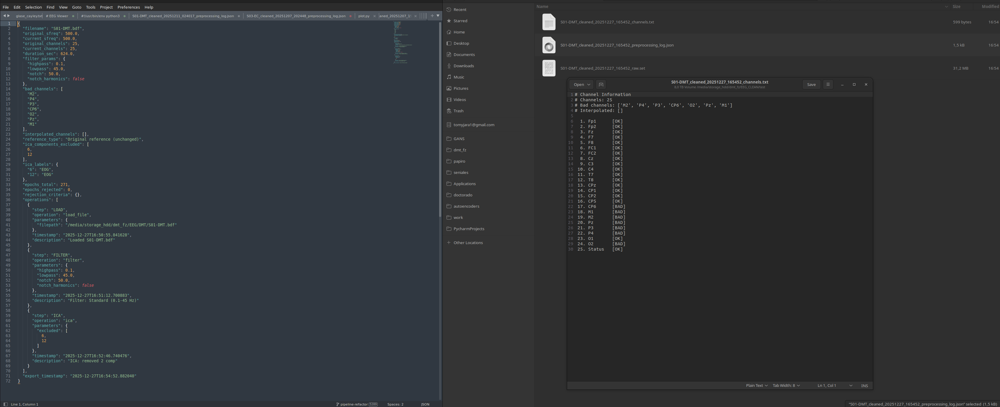
</p>

Vista del EEG después del procesamiento completo.

---

## Pipeline - Procesamiento Batch

<p align="center">
  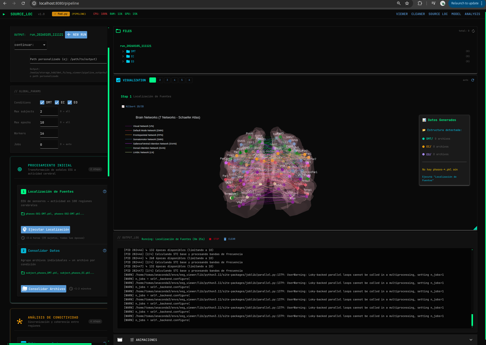
</p>

Ejecución automatizada de scripts de procesamiento para localización de fuentes y análisis de conectividad.

### Layout

```
┌─────────────────────────────────────────────────────────────────┐
│ HEADER - Título, Indicador de Ejecución, CPU/RAM/GPU            │
├────────────────┬────────────────────────────────────────────────┤
│ LEFT PANEL     │ RIGHT PANEL                                    │
│ (450px)        │ (flexible)                                     │
│                │                                                 │
│ - IO Config    │ ┌──────────────────────────────────────┐       │
│ - Global Params│ │ FILE BROWSER                         │       │
│                │ ├──────────────────────────────────────┤       │
│ FASES:         │ │ VISUALIZATION [1][2][3]...[8]        │       │
│ ┌────────────┐ │ ├──────────────────────────────────────┤       │
│ │ FASE 1     │ │ │ CONSOLE                              │       │
│ │ Steps 1-2  │ │ └──────────────────────────────────────┘       │
│ ├────────────┤ │                                                 │
│ │ FASE 2     │ │ [🎬 ANIMATIONS]                                │
│ │ Steps 3-6  │ │                                                 │
│ ├────────────┤ │                                                 │
│ │ FASE 3     │ │                                                 │
│ │ Steps 7-8  │ │                                                 │
│ └────────────┘ │                                                 │
└────────────────┴────────────────────────────────────────────────┘
```

---

### Configuración I/O

<p align="center">
  
</p>

Define los directorios de entrada y salida.

| Campo | Descripción |
|-------|-------------|
| **Input Dir** | Directorio con archivos EEG limpios |
| **Output Dir** | Directorio para resultados del pipeline |
| **Run Dir** | Subdirectorio con timestamp para esta ejecución |

---

### Parámetros Globales

<p align="center">
  
</p>

Configuración que aplica a todos los pasos.

| Parámetro | Descripción |
|-----------|-------------|
| **Conditions** | Condiciones a procesar (DMT, EC, EO) |
| **Max Subjects** | Límite de sujetos (0 = todos) |
| **Max Epochs** | Límite de épocas por sujeto |
| **Workers** | Procesos paralelos |
| **Jobs** | Hilos por proceso |

---

### Fase 1: Modelo Forward

Cálculo del modelo forward para localización de fuentes.

#### Step 1: Forward Model (`fwd.py`)

<p align="center">
  
</p>

Calcula el modelo forward usando el template fsaverage.

#### Step 2: Consolidate (`save_load_pickle.py`)

<p align="center">
  
</p>

Consolida los datos para procesamiento posterior.

---

### Fase 2: Análisis de Red

Extracción de fases y cálculo de sincronización.

#### Step 3: Network Filter (`multi2pool2.py`)

<p align="center">
  
</p>

Extracción paralela de fases por banda de frecuencia.

#### Step 4: Synchronization (`calculate_syncro.py`)

<p align="center">
  
</p>

Calcula métricas de sincronización usando el parámetro de orden de Kuramoto.

#### Step 5: Order Parameter (`generate_order.py`)

<p align="center">
  
</p>

Genera el parámetro de orden temporal.

#### Step 6: Aggregate (`build_order_data.py`)

<p align="center">
  
</p>

Agrega métricas de orden a través de sujetos y condiciones.

---

### Fase 3: Análisis Estadístico

Correlaciones y clustering.

#### Step 7: Pearson (`pearson.py`)

<p align="center">
  
</p>

Calcula correlaciones de Pearson entre condiciones.

#### Step 8: Clustering (`clustering.py`)

<p align="center">
  
</p>

Análisis de clustering K-means de estados cerebrales.

---

### Panel de Visualización

<p align="center">
  
</p>

Visualizaciones contextuales que cambian según el paso seleccionado.

#### Pestañas de Visualización

Cada paso tiene su propia pestaña con visualizaciones específicas:

| Paso | Visualización |
|------|---------------|
| 1 | Topografía forward |
| 2 | Estadísticas de consolidación |
| 3 | Fases por banda |
| 4 | Mapas de sincronización |
| 5 | Series de orden temporal |
| 6 | Distribuciones agregadas |
| 7 | Matrices de correlación |
| 8 | Resultados de clustering |

---

### Consola de Salida

<p align="center">
  
</p>

Log en tiempo real de la ejecución.

#### Características

- Colores por tipo de mensaje (info, success, warning, error)
- Auto-scroll al final
- Botón Clear para limpiar
- Historial persistente

---

### Generador de Animaciones

<p align="center">
  
</p>

Crea animaciones de la actividad cerebral.

#### Parámetros

| Campo | Descripción |
|-------|-------------|
| **Subject** | Sujeto a animar |
| **Condition** | Condición (DMT, EC, EO) |
| **Band** | Banda de frecuencia |
| **FPS** | Cuadros por segundo |
| **Duration** | Duración en segundos |

---

## Model - Entrenamiento de Redes Neuronales

<p align="center">
  
</p>

Entrenamiento de Variational Autoencoders (VAE) y Graph Neural Networks (GNN) sobre datos EEG.

---

### Dataset Scanner

<p align="center">
  
</p>

Escaneo inteligente del dataset.

#### Tipos Detectados

| Tipo | Descripción |
|------|-------------|
| **Graph** | Archivos `phases-*.pkl`, PyTorch Geometric |
| **Image** | PNG, JPG, TIFF |
| **TimeSeries** | EEG raw (.bdf, .edf), Arrays (.npy) |
| **Tabular** | CSV, Excel, Parquet |
| **Text** | TXT, JSON |

#### Información Mostrada

- Tipo de dataset
- Número de archivos
- Condiciones/clases detectadas
- Sujetos
- Bandas de frecuencia (para datos de fase)
- Nodos EEG/STC

---

### Configuración del Modelo

<p align="center">
  
</p>

Parámetros de arquitectura y entrenamiento.

#### Arquitectura

| Parámetro | Descripción |
|-----------|-------------|
| **Latent** | Dimensión del espacio latente |
| **Hidden** | Dimensión de capas ocultas |
| **GAT layers** | Número de capas GAT del encoder |
| **Heads** | Cabezas de atención |
| **Dropout** | Regularización |

#### Entrenamiento

| Parámetro | Descripción |
|-----------|-------------|
| **Epochs** | Épocas de entrenamiento |
| **Batch** | Tamaño del batch |
| **Learn rate** | Tasa de aprendizaje |
| **Optimizer** | AdamW, Adam, SGD |
| **Scheduler** | Cosine, ReduceOnPlateau |

---

### Controles de Entrenamiento

<p align="center">
  
</p>

| Botón | Acción |
|-------|--------|
| **Train** | Inicia el entrenamiento |
| **Stop** | Detiene el entrenamiento |

El entrenamiento continúa en background incluso si navegas a otra página.

---

### Visualización de Arquitectura

<p align="center">
  
</p>

Diagrama visual de la arquitectura del modelo.

```
INPUT → ENCODER → LATENT → DECODER → OUTPUT
        (GAT×3)   (μ + σ)   (MLP)
```

---

### Métricas de Entrenamiento

<p align="center">
  
</p>

Gráficos en tiempo real del progreso del entrenamiento.

#### Métricas Mostradas

| Métrica | Descripción |
|---------|-------------|
| **Total Loss** | Loss total (train + val) |
| **Recon Loss** | Error de reconstrucción |
| **KL Loss** | Divergencia KL |
| **Best Val** | Mejor loss de validación |
| **Current Epoch** | Época actual |

---

### Calidad de Reconstrucción

<p align="center">
  
</p>

Comparación original vs reconstruido.

#### Paneles

1. **Original**: Datos de entrada
2. **Reconstructed**: Salida del modelo
3. **Difference**: Error absoluto

#### Métricas

- MSE (Error Cuadrático Medio)
- MAE (Error Absoluto Medio)

---

## Analysis - Exploración de Modelos

<p align="center">
  
</p>

Inspección y análisis de modelos entrenados.

---

### Carga de Modelos

<p align="center">
  
</p>

Selecciona y carga checkpoints de modelos entrenados.

#### Información Mostrada

- Ruta del checkpoint
- Arquitectura del modelo
- Mejor loss de validación
- Época del checkpoint

---

### Espacio Latente PCA

<p align="center">
  
</p>

Visualización del espacio latente usando PCA o t-SNE.

#### Características

- Puntos coloreados por condición
- Interactivo (zoom, pan, hover)
- Varianza explicada por componente

---

### Activaciones por Capa

<p align="center">
  
</p>

Visualiza las activaciones de cada capa del modelo.

#### Capas Disponibles

- Capas GAT del encoder
- Capa latente (μ, σ)
- Capas del decoder

---

### Pesos de Atención

<p align="center">
  
</p>

Visualización de los pesos de atención (solo modelos GAT).

#### Visualización

- Matriz de atención por cabeza
- Topografía cerebral con conexiones
- Grafo de atención interactivo

---

## Navegación Global

### Header y Monitor de Sistema

<p align="center">
  
</p>

Presente en todas las páginas.

#### Componentes

| Elemento | Descripción |
|----------|-------------|
| **Logo/Título** | Nombre de la aplicación |
| **Indicador de Ejecución** | Muestra si hay procesos corriendo |
| **CPU** | Uso actual del procesador |
| **RAM** | Memoria utilizada |
| **GPU** | Uso y memoria de GPU (si disponible) |

---

### Barra de Navegación

<p align="center">
  
</p>

Acceso rápido a todas las páginas.

| Botón | Página | URL |
|-------|--------|-----|
| **VIEWER** | Visualización | `/` |
| **CLEANER** | Preprocesamiento | `/cleaner` |
| **PIPELINE** | Batch processing | `/pipeline` |
| **MODEL** | Entrenamiento | `/model` |
| **ANALYSIS** | Análisis | `/analysis` |

---

### Atajos de Teclado

| Atajo | Acción | Página |
|-------|--------|--------|
| `Space` | Play/Pause | Viewer |
| `←` | Segmento anterior | Viewer |
| `→` | Segmento siguiente | Viewer |
| `Home` | Ir al inicio | Viewer |
| `End` | Ir al final | Viewer |

---

## Solución de Problemas

### Problemas Comunes

#### "No module named 'mne'"

```bash
source venv/bin/activate  # Linux/macOS
pip install -r requirements.txt
```

#### "File not found"

Verifica que los directorios EEG existan:
- `../EEG/DMT/`, `../EEG/EC/`, `../EEG/EO/`
- `../EEG_CLEAN/DMT/`, etc.

#### "Port 8080 already in use"

Cambia el puerto en `main.py`:
```python
ui.run(port=8081, ...)
```

#### ICA muy lento

- Reduce el número de componentes (15-20)
- Usa método 'picard' en lugar de 'fastica'
- Aplica filtro highpass de 1 Hz antes de ICA

#### Memoria insuficiente

- Recorta archivos largos: `raw.crop(tmax=300)`
- Reduce el número de canales mostrados
- Usa `preload=False` al escanear directorios

---

## Contribución

¿Encontraste un bug o tienes una sugerencia? 

1. Abre un issue describiendo el problema
2. Incluye capturas de pantalla si es posible
3. Menciona tu sistema operativo y versión de Python

---

<p align="center">
  <i>EEG Viewer - Parte del proyecto DMT_FZ</i>
</p>

