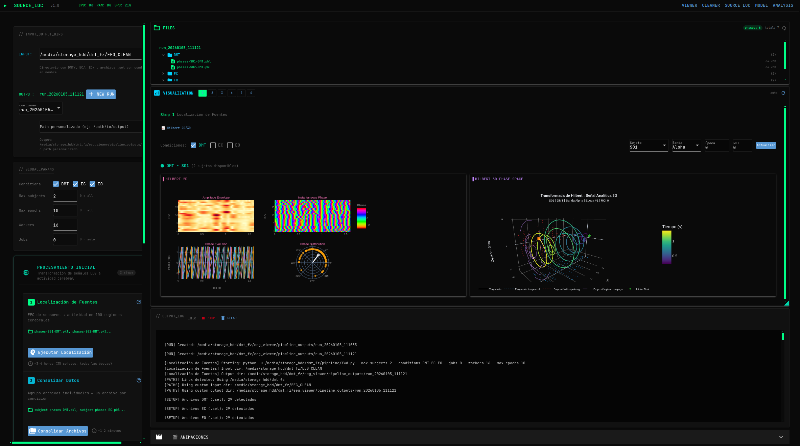
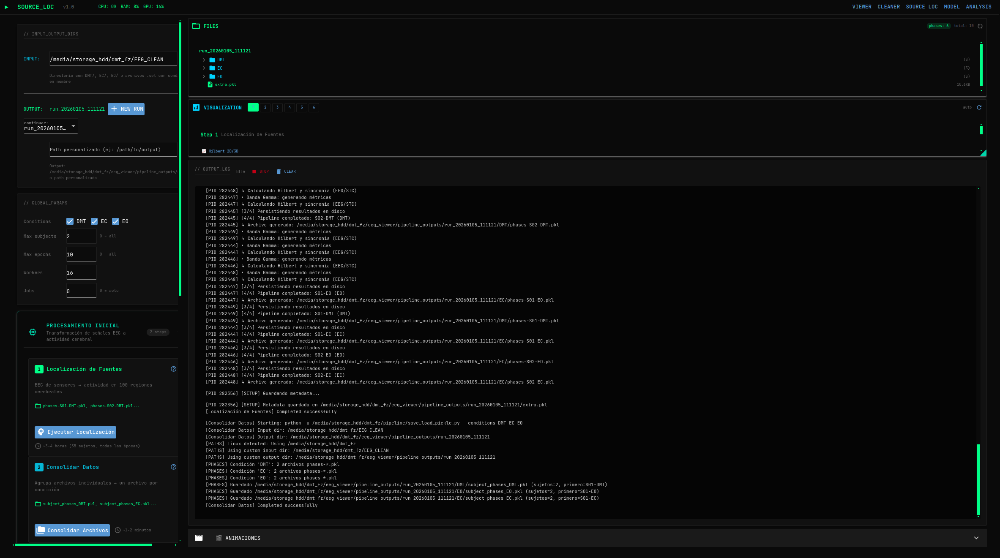
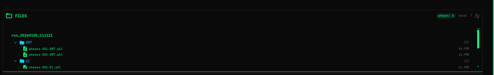
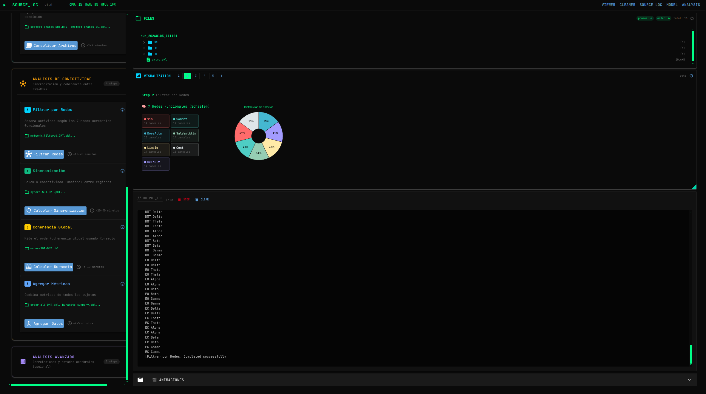
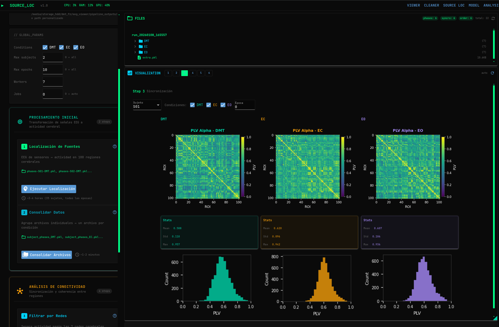
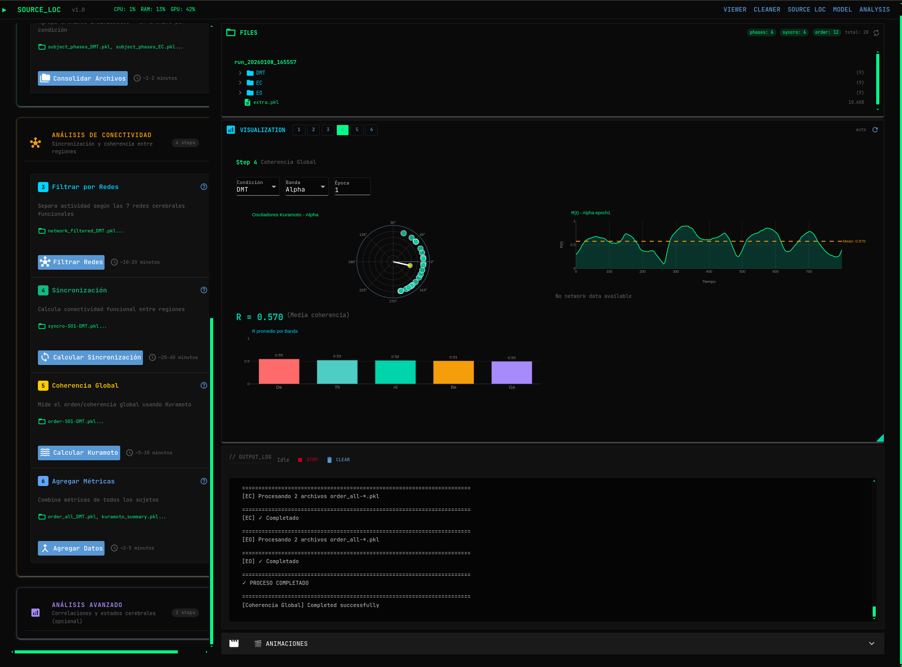
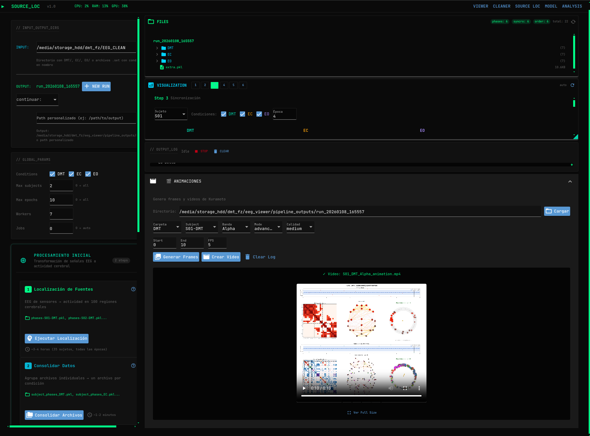

# EEG Viewer - Guía de la Interfaz

> **Suite completa de procesamiento y visualización de EEG**

Una aplicación web modular para visualización de datos EEG, preprocesamiento, ejecución de pipelines y análisis de redes neuronales. Construida con [NiceGUI](https://nicegui.io/) y [MNE-Python](https://mne.tools/).

---

## Tabla de Contenidos

- [EEG Viewer - Guía de la Interfaz](#eeg-viewer---guía-de-la-interfaz)
  - [Tabla de Contenidos](#tabla-de-contenidos)
  - [Resumen General](#resumen-general)
    - [Formatos Soportados](#formatos-soportados)
  - [Instalación Rápida](#instalación-rápida)
  - [Viewer - Visualización Interactiva](#viewer---visualización-interactiva)
    - [Vista General](#vista-general)
    - [File Browser y Carga de Archivos](#file-browser-y-carga-de-archivos)
      - [Características](#características)
      - [Cómo Cargar un Archivo](#cómo-cargar-un-archivo)
      - [Formatos Soportados](#formatos-soportados-1)
    - [Filtros y Selección de Canales](#filtros-y-selección-de-canales)
      - [Controles de Filtrado](#controles-de-filtrado)
      - [Selección de Canales](#selección-de-canales)
    - [Visualizaciones y Análisis](#visualizaciones-y-análisis)
      - [Gráficos EEG](#gráficos-eeg)
      - [Navegación Temporal](#navegación-temporal)
      - [Topografía Cerebral (TOPO)](#topografía-cerebral-topo)
      - [Análisis FFT](#análisis-fft)
      - [Transformada de Hilbert](#transformada-de-hilbert)
    - [Modo Comparación](#modo-comparación)
      - [Cómo Activar el Modo Comparación](#cómo-activar-el-modo-comparación)
      - [Visualización Dual](#visualización-dual)
    - [Gráficos de Diferencia](#gráficos-de-diferencia)
      - [FFT DIFF (Diferencia Espectral)](#fft-diff-diferencia-espectral)
      - [HILBERT DIFF (Diferencia de Envolvente y Fase)](#hilbert-diff-diferencia-de-envolvente-y-fase)
      - [Código de Colores](#código-de-colores)
      - [Controles del Modo Comparación](#controles-del-modo-comparación)
    - [Generación de Epochs (Dataset)](#generación-de-epochs-dataset)
      - [Parámetros](#parámetros)
      - [Proceso de Generación](#proceso-de-generación)
      - [Archivos de Salida](#archivos-de-salida)
    - [Demo Completa](#demo-completa)
  - [Cleaner - Pipeline de Preprocesamiento](#cleaner---pipeline-de-preprocesamiento)
    - [Vista General](#vista-general-1)
    - [Flujo del Pipeline](#flujo-del-pipeline)
    - [Características](#características-1)
    - [1. Load](#1-load)
    - [2. Filter](#2-filter)
    - [3. Bad Channels](#3-bad-channels)
    - [4. Rereference](#4-rereference)
    - [5. ICA](#5-ica)
    - [6. Epochs](#6-epochs)
    - [7. Reject](#7-reject)
    - [8. Export](#8-export)
    - [Resultados](#resultados)
  - [Source Localization - Localización de Fuentes](#source-localization---localización-de-fuentes)
    - [Descripción General](#descripción-general)
    - [Layout](#layout)
    - [Configuración I/O](#configuración-io)
    - [Parámetros Globales](#parámetros-globales)
    - [Fase 1: Modelo Forward](#fase-1-modelo-forward)
      - [Step 1: Forward Model (`fwd.py`)](#step-1-forward-model-fwdpy)
      - [Step 2: Consolidate (`save_load_pickle.py`)](#step-2-consolidate-save_load_picklepy)
    - [Fase 2: Análisis de Red](#fase-2-análisis-de-red)
      - [Step 3: Network Filter (`multi2pool2.py`)](#step-3-network-filter-multi2pool2py)
      - [Step 4: Synchronization (`calculate_syncro.py`)](#step-4-synchronization-calculate_syncropy)
      - [Step 5: Order Parameter (`generate_order.py`)](#step-5-order-parameter-generate_orderpy)
      - [Step 6: Aggregate (`build_order_data.py`)](#step-6-aggregate-build_order_datapy)
    - [Fase 3: Análisis Estadístico](#fase-3-análisis-estadístico)
      - [Step 7: Pearson (`pearson.py`)](#step-7-pearson-pearsonpy)
      - [Step 8: Clustering (`clustering.py`)](#step-8-clustering-clusteringpy)
    - [Consola de Salida](#consola-de-salida)
      - [Características](#características-2)
    - [Generador de Animaciones](#generador-de-animaciones)
      - [Parámetros](#parámetros-1)
      - [Controles](#controles)
  - [Model - Entrenamiento de Redes Neuronales](#model---entrenamiento-de-redes-neuronales)
    - [Dataset Scanner](#dataset-scanner)
      - [Tipos Detectados](#tipos-detectados)
      - [Información Mostrada](#información-mostrada)
    - [Configuración del Modelo](#configuración-del-modelo)
      - [Arquitectura](#arquitectura)
      - [Entrenamiento](#entrenamiento)
    - [Controles de Entrenamiento](#controles-de-entrenamiento)
    - [Visualización de Arquitectura](#visualización-de-arquitectura)
    - [Métricas de Entrenamiento](#métricas-de-entrenamiento)
      - [Métricas Mostradas](#métricas-mostradas)
    - [Calidad de Reconstrucción](#calidad-de-reconstrucción)
      - [Paneles](#paneles)
      - [Métricas](#métricas)
  - [Analysis - Exploración de Modelos](#analysis---exploración-de-modelos)
    - [Carga de Modelos](#carga-de-modelos)
      - [Información Mostrada](#información-mostrada-1)
    - [Espacio Latente PCA](#espacio-latente-pca)
      - [Características](#características-3)
    - [Activaciones por Capa](#activaciones-por-capa)
      - [Capas Disponibles](#capas-disponibles)
    - [Pesos de Atención](#pesos-de-atención)
      - [Visualización](#visualización)
  - [Navegación Global](#navegación-global)
    - [Header y Monitor de Sistema](#header-y-monitor-de-sistema)
      - [Componentes](#componentes)
    - [Barra de Navegación](#barra-de-navegación)
    - [Atajos de Teclado](#atajos-de-teclado)
  - [Solución de Problemas](#solución-de-problemas)
    - [Problemas Comunes](#problemas-comunes)
      - ["No module named 'mne'"](#no-module-named-mne)
      - ["File not found"](#file-not-found)
      - ["Port 8080 already in use"](#port-8080-already-in-use)
      - [ICA muy lento](#ica-muy-lento)
      - [Memoria insuficiente](#memoria-insuficiente)
  - [Contribución](#contribución)

---

## Resumen General

EEG Viewer es una aplicación multi-página que proporciona un flujo de trabajo completo para el análisis de señales EEG:

| Página | URL | Propósito |
|--------|-----|-----------|
| **Viewer** | `/` | Visualización interactiva con comparación dual |
| **Cleaner** | `/cleaner` | Pipeline de preprocesamiento paso a paso |
| **Source Loc** | `/pipeline` | Localización de fuentes y análisis de conectividad |
| **Model** | `/model` | Entrenamiento de redes neuronales (VAE/GNN) |
| **Analysis** | `/analysis` | Inspección de modelos y exploración del espacio latente |

### Formatos Soportados

- **BDF** - BioSemi (formato principal)
- **EDF** - European Data Format
- **SET** - EEGLAB
- **FIF** - Formato nativo de MNE

---

## Instalación Rápida

```bash
# Linux/macOS
cd eeg_viewer
chmod +x run.sh
./run.sh

# Windows
cd eeg_viewer
run.bat
```

Después de iniciar, abre tu navegador en: `http://localhost:8080`

---

## Viewer - Visualización Interactiva

La página principal del Viewer (`/`) permite explorar archivos EEG con visualizaciones en tiempo real y la posibilidad de comparar dos archivos simultáneamente.

### Vista General

<p align="center">
  
</p>

La interfaz está dividida en dos áreas principales:

**Panel Izquierdo (Sidebar):**
- **FILE_BROWSER**: Navegación y carga de archivos EEG
- **FILE_INFO**: Información del archivo cargado (frecuencia, canales, duración)
- **CHANNELS**: Selección de canales a visualizar

**Panel Principal (Derecha):**
- **FILTERS**: Controles de filtrado (Notch, Bandpass)
- **EEG**: Visualización de señales multi-canal
- **Navigation**: Controles de reproducción y navegación temporal
- **TOPO**: Mapas topográficos de actividad cerebral
- **FFT**: Análisis espectral de potencia
- **HILBERT**: Transformada de Hilbert (envolvente y fase)
- **DATASET**: Generación y exportación de épocas

---

### File Browser y Carga de Archivos

El panel de **FILE_BROWSER** permite navegar y cargar archivos EEG de forma rápida.

#### Características

| Función | Descripción |
|---------|-------------|
| **Auto-descubrimiento** | Escanea automáticamente las carpetas `EEG/` y `EEG_CLEAN/` |
| **Organización** | Los archivos se agrupan por condición (DMT, EC, EO, etc.) |
| **Carga rápida** | Click en ▶ para cargar instantáneamente |
| **Rutas personalizadas** | Añade directorios adicionales con el input de ruta |
| **Dual loading** | Selector "Load to:" para elegir EEG 1 o EEG 2 |

#### Cómo Cargar un Archivo

1. Los archivos aparecen agrupados por carpeta (`raw/`, `clean/`)
2. Expande una condición para ver los archivos disponibles
3. Haz click en el botón ▶ junto al archivo para cargarlo
4. El panel **FILE_INFO** mostrará: frecuencia de muestreo, número de canales y duración

#### Formatos Soportados

- **BDF** - BioSemi Data Format (formato principal)
- **EDF** - European Data Format
- **SET** - EEGLAB
- **FIF** - MNE Native Format

---

### Filtros y Selección de Canales

<p align="center">
  
</p>

#### Controles de Filtrado

Los filtros se aplican en tiempo real a todas las visualizaciones.

| Filtro | Descripción | Valores Típicos |
|--------|-------------|-----------------|
| **Notch** | Elimina ruido de línea eléctrica | 50 Hz (Europa), 60 Hz (América) |
| **Bandpass** | Aísla frecuencias de interés EEG | 1-45 Hz (estándar) |

**Cómo usar:**
1. Activa el switch del filtro deseado
2. Ajusta los valores según necesidad
3. Click en **Apply** para ver los cambios

#### Selección de Canales

El panel **CHANNELS** permite elegir qué electrodos visualizar:

| Botón | Acción |
|-------|--------|
| **ALL** | Selecciona todos los canales EEG |
| **10** | Selecciona los primeros 10 canales |
| **CLEAR** | Deselecciona todos los canales |

Los canales seleccionados se muestran en todos los gráficos (EEG, FFT, Topografía).

---

### Visualizaciones y Análisis

#### Gráficos EEG

Visualización de señales multi-canal con auto-escalado inteligente:

- **Colores distintivos**: Cada canal tiene un color único
- **Normalización**: Las señales se normalizan para evitar superposición
- **Hover info**: Pasa el mouse sobre una traza para ver el valor exacto en µV

**Controles de Escala:**

| Botón | Acción |
|-------|--------|
| `-` | Reduce la separación entre canales |
| `1x` | Restaura la escala por defecto |
| `+` | Aumenta la separación entre canales |

#### Navegación Temporal

| Icono | Acción | Atajo de Teclado |
|-------|--------|------------------|
| `⏮` | Ir al inicio | `Home` |
| `⏪` | Reproducir hacia atrás | - |
| `◀` | Segmento anterior | `←` |
| `▶` | Play/Pause | `Space` |
| `▶` | Segmento siguiente | `→` |
| `⏩` | Avance rápido (4x) | - |
| `⏭` | Ir al final | `End` |

**Duración de Ventana:** Botones `2s`, `5s`, `10s`, `20s` para ajustar cuántos segundos mostrar.

#### Topografía Cerebral (TOPO)

Mapa topográfico que muestra la actividad por electrodo usando el sistema 10-20:
- **Escala de color**: Azul (baja) → Verde → Amarillo → Rojo (alta actividad)
- **Electrodos activos**: Se muestran resaltados con valores en µV
- **Electrodos inactivos**: Aparecen atenuados

#### Análisis FFT

Espectro de potencia con bandas de frecuencia anotadas:

| Banda | Rango (Hz) | Asociación |
|-------|------------|------------|
| **δ** Delta | 1-4 | Sueño profundo |
| **θ** Theta | 4-8 | Relajación, meditación |
| **α** Alpha | 8-13 | Vigilia relajada |
| **β** Beta | 13-30 | Actividad cognitiva |
| **γ** Gamma | 30-45 | Procesamiento alto |

#### Transformada de Hilbert

Análisis de amplitud instantánea y fase:
- **ENVELOPE**: Señal original con envolvente superpuesta
- **PHASE**: Fase instantánea (-π a +π)
- **Selector de canal**: Dropdown para elegir qué canal analizar

---

### Modo Comparación

<p align="center">
  
</p>

El modo comparación permite visualizar **dos archivos EEG lado a lado** para análisis comparativo.

#### Cómo Activar el Modo Comparación

1. Carga un archivo en **EEG 1** (por defecto)
2. Cambia el selector "Load to:" a **EEG 2**
3. Carga un segundo archivo
4. Click en el botón **Compare** para activar el modo dual

#### Visualización Dual

En modo comparación, todos los gráficos se duplican:
- **EEG 1** (verde) | **EEG 2** (rosa)
- **TOPO 1** | **TOPO 2**
- **FFT 1** | **FFT 2**
- **HILBERT 1** | **HILBERT 2**

Ambos EEGs comparten la misma posición temporal y navegación sincronizada.

---

### Gráficos de Diferencia

<p align="center">
  
</p>

Además de la visualización dual, el modo comparación incluye **gráficos de diferencia** que muestran la resta entre ambos EEGs:

#### FFT DIFF (Diferencia Espectral)

Muestra `EEG1 - EEG2` en el dominio de frecuencia:
- **Valores positivos** (arriba de cero): EEG 1 tiene mayor potencia
- **Valores negativos** (debajo de cero): EEG 2 tiene mayor potencia

#### HILBERT DIFF (Diferencia de Envolvente y Fase)

- **ΔENVELOPE**: Diferencia de amplitud instantánea
- **ΔPHASE**: Diferencia de fase (wraped a [-π, π])

#### Código de Colores

| Color | Significado |
|-------|-------------|
| **Cyan / Positivo** | EEG 1 tiene mayor actividad |
| **Rosa / Negativo** | EEG 2 tiene mayor actividad |
| **Púrpura** | Línea de diferencia |

#### Controles del Modo Comparación

| Botón | Acción |
|-------|--------|
| **Compare** | Activa/desactiva el modo comparación |
| **Clear 2** | Descarga EEG 2 y desactiva comparación |

---

### Generación de Epochs (Dataset)

El panel **DATASET** en la parte inferior permite segmentar el registro en épocas para análisis posterior o entrenamiento de modelos.

#### Parámetros

| Campo | Descripción | Rango |
|-------|-------------|-------|
| **Epoch** | Duración de cada época | 0.5 - 30 segundos |

#### Proceso de Generación

1. Ajusta la duración de las épocas en segundos
2. Click en **Generate** para crear las épocas
3. El contador mostrará cuántas épocas se generaron
4. Click en **Save Dataset** para exportar

#### Archivos de Salida

Los archivos se guardan en `epochs_output/` dentro del directorio del archivo original:

| Archivo | Contenido |
|---------|-----------|
| `{nombre}_epochs_{timestamp}.npy` | Datos crudos de cada época |
| `{nombre}_fft_{timestamp}.npy` | FFT calculado para cada época |
| `{nombre}_meta_{timestamp}.csv` | Metadatos (archivo, sfreq, n_epochs, duración) |

---

### Demo Completa

<p align="center">
  
</p>

El GIF anterior muestra un flujo de trabajo típico en el Viewer:
1. Carga de archivo EEG
2. Aplicación de filtros
3. Navegación temporal
4. Activación del modo comparación
5. Visualización de diferencias

---

## Cleaner - Pipeline de Preprocesamiento

La página Cleaner (`/cleaner`) proporciona un pipeline de limpieza y preprocesamiento de EEG con 8 pasos.

### Vista General

<p align="center">
  
</p>

**Panel Izquierdo:** Steps con indicadores de estado, navegación Previous/Next, información del archivo.

**Panel Principal:** Controles del paso actual, visualización EEG en tiempo real, estadísticas.

### Flujo del Pipeline

```
LOAD → FILTER → BAD_CHANNELS → REREFERENCE → ICA → EPOCHS → REJECT → EXPORT
```

### Características

- **Undo/Redo** en cada paso
- **Indicadores** de pasos completados (✓)
- **Navegación libre** entre pasos

---

### 1. Load

Carga el archivo EEG a procesar. Formatos soportados: `.bdf`, `.edf`, `.set`, `.fif`

Al cargar se muestra: frecuencia de muestreo, número de canales, duración y tipos de canales.

---

### 2. Filter

<p align="center">
  
</p>

Aplica filtros para limpiar la señal.

| Preset | Highpass | Lowpass | Notch |
|--------|----------|---------|-------|
| **Standard** | 0.1 Hz | 45 Hz | 50 Hz |
| **Research** | 1 Hz | 40 Hz | 50 Hz |
| **Clinical** | 0.5 Hz | 70 Hz | 50/60 Hz |
| **Custom** | Manual | Manual | Manual |

---

### 3. Bad Channels

<p align="center">
  
</p>

Detecta e interpola canales defectuosos.

| Tipo | Criterio |
|------|----------|
| **Flat** | Varianza < umbral |
| **Noisy** | Varianza > umbral |
| **Uncorrelated** | Baja correlación con vecinos |

**Acciones:** Auto Detect → Manual Select → Interpolate

---

### 4. Rereference

<p align="center">
  
</p>

Cambia la referencia de los canales EEG.

| Tipo | Descripción |
|------|-------------|
| **Average** | Promedio de todos los canales |
| **Linked Mastoids** | Promedio de M1 y M2 |
| **Single Electrode** | Un electrodo (ej: Cz) |
| **REST** | Referencia infinita estimada |

---

### 5. ICA

<p align="center">
  
</p>

Análisis de Componentes Independientes para eliminar artefactos (EOG, ECG, movimientos).

**Proceso:** Compute ICA → Auto Detect → Manual Review → Exclude → Apply

**Visualizaciones:** Topografía, serie temporal, espectro, correlación con EOG/ECG.

---

### 6. Epochs

<p align="center">
  
</p>

Divide el registro en segmentos de longitud fija.

| Parámetro | Descripción |
|-----------|-------------|
| **Duration** | Longitud de cada época (1-5 seg) |
| **Overlap** | Solapamiento entre épocas (0-50%) |

---

### 7. Reject

<p align="center">
  
</p>

Elimina épocas con artefactos según criterios de amplitud.

| Criterio | Valor Típico |
|----------|--------------|
| **Peak-to-peak** | 100-200 µV |
| **Flat** | 0.5 µV |
| **Gradient** | 50-100 µV/ms |

---

### 8. Export

<p align="center">
  
</p>

Exporta los datos procesados.

**Formatos:** FIF (recomendado), SET, EDF, NPY, CSV

**Archivos adicionales:** `preprocessing_log.json`, `bad_channels.txt`, `ica_excluded.txt`

---

### Resultados

<p align="center">
  
</p>

Vista del EEG después del procesamiento completo.

---

## Source Localization - Localización de Fuentes

<p align="center">
  
</p>

Vista general de la página Source Localization mostrando el **grafo cerebral 3D** con las 7 redes funcionales (Schaefer Atlas), el panel de pasos del pipeline a la izquierda, y la consola de ejecución en tiempo real.

Ejecución automatizada de scripts de procesamiento para **localización de fuentes corticales** y **análisis de conectividad funcional** basado en sincronización de fase.

### Descripción General

Este módulo implementa un pipeline completo de análisis EEG que incluye:

1. **Localización de fuentes** usando el modelo forward con template fsaverage
2. **Extracción de fases instantáneas** por banda de frecuencia (Delta, Theta, Alpha, Beta, Gamma)
3. **Análisis de sincronización** usando el parámetro de orden de Kuramoto
4. **Análisis de redes cerebrales** (DMN, FPN, DAN, SMN, VN, Limbic, Salience)
5. **Correlaciones con experiencia subjetiva** (cuestionarios)
6. **Clustering de estados cerebrales**

El pipeline procesa archivos `.set` (EEGLAB) previamente limpiados y genera métricas de conectividad funcional para comparar condiciones experimentales (DMT vs. Eyes Closed vs. Eyes Open).

---

### Layout

```
┌─────────────────────────────────────────────────────────────────┐
│ HEADER - Título, Indicador de Ejecución, CPU/RAM/GPU            │
├────────────────┬────────────────────────────────────────────────┤
│ LEFT PANEL     │ RIGHT PANEL                                    │
│ (450px)        │ (flexible)                                     │
│                │                                                 │
│ - IO Config    │ ┌──────────────────────────────────────┐       │
│ - Global Params│ │ FILE BROWSER                         │       │
│                │ ├──────────────────────────────────────┤       │
│ FASES:         │ │ VISUALIZATION [1][2][3]...[8]        │       │
│ ┌────────────┐ │ ├──────────────────────────────────────┤       │
│ │ FASE 1     │ │ │ CONSOLE                              │       │
│ │ Steps 1-2  │ │ └──────────────────────────────────────┘       │
│ ├────────────┤ │                                                 │
│ │ FASE 2     │ │ [🎬 ANIMATIONS]                                │
│ │ Steps 3-6  │ │                                                 │
│ ├────────────┤ │                                                 │
│ │ FASE 3     │ │                                                 │
│ │ Steps 7-8  │ │                                                 │
│ └────────────┘ │                                                 │
└────────────────┴────────────────────────────────────────────────┘
```

---

### Configuración I/O

Define los directorios de entrada y salida. La configuración se encuentra en el panel superior izquierdo (visible en la imagen de overview).

| Campo | Descripción |
|-------|-------------|
| **Input Dir** | Directorio con archivos EEG limpios (`.set`) organizados en subcarpetas `DMT/`, `EC/`, `EO/` |
| **Output Dir** | Directorio base para resultados del pipeline (default: `pipeline_outputs/`) |
| **Run Dir** | Subdirectorio con timestamp para esta ejecución (`run_YYYYMMDD_HHMMSS`) |

**Estructura de entrada esperada:**
```
EEG_CLEAN/
├── DMT/
│   ├── S01_DMT_ICA_pruned.set
│   ├── S02_DMT_ICA_pruned.set
│   └── ...
├── EC/
│   ├── S01_EC_ICA_pruned.set
│   └── ...
└── EO/
    ├── S01_EO_ICA_pruned.set
    └── ...
```

---

### Parámetros Globales

Configuración que aplica a todos los pasos del pipeline. Los parámetros se encuentran en el panel izquierdo bajo `// GLOBAL_PARAMS`.

| Parámetro | Descripción | Valor Típico |
|-----------|-------------|--------------|
| **Conditions** | Condiciones experimentales a procesar | DMT, EC, EO |
| **Max Subjects** | Límite de sujetos por condición (0 = todos) | 0-35 |
| **Max Epochs** | Límite de épocas por sujeto (0 = todas) | 0-100 |
| **Workers** | Número de procesos paralelos | 1-20 |
| **Jobs** | Hilos por proceso (para operaciones MNE) | 1-8 |

**Nota:** El balance entre `workers` y `jobs` depende de tu hardware. Para 8 núcleos, `workers=4, jobs=2` es un buen punto de partida.

---

### Fase 1: Modelo Forward

Esta fase transforma los datos EEG de espacio de sensores a espacio de fuentes corticales usando el problema inverso.

#### Step 1: Forward Model (`fwd.py`)

<p align="center">
  
</p>

La visualización incluye:
- **Hilbert 2D:** Envolvente de amplitud, fase instantánea, evolución de fase y distribución
- **Hilbert 3D Phase Space:** Atractor tridimensional de la señal analítica (trayectorias, proyecciones)

<p align="center">
  
</p>

El console log muestra el progreso del procesamiento: cálculo de Hilbert, sincronía, persistencia de archivos `phases-*.pkl` para cada sujeto y condición.

**Propósito:** Calcular la localización de fuentes corticales y extraer métricas de sincronización.

**Proceso detallado:**
1. **Carga de épocas:** Lee archivos `.set` (EEGLAB epochs)
2. **Setup del modelo forward:**
   - Usa template **fsaverage** (MNE-Python)
   - Modelo BEM de 3 capas (5120 vértices)
   - Atlas de **Schaefer (100 parcelas, 7 redes)**
3. **Cálculo del operador inverso:**
   - Método: **dSPM** (dynamic Statistical Parametric Mapping)
   - SNR = 3.0, λ² = 1/9
4. **Extracción por época y banda:**
   - Filtrado pasabanda (Delta: 1-4 Hz, Theta: 4-8 Hz, Alpha: 8-13 Hz, Beta: 13-30 Hz, Gamma: 30-45 Hz)
   - Transformada de Hilbert → amplitud instantánea y fase
   - Cálculo de matrices de sincronización (PLV-like)
   - Parámetro de orden de Kuramoto: \( r(t) = \left| \frac{1}{N} \sum_{j=1}^{N} e^{i\theta_j(t)} \right| \)

**Salidas:**
- `phases-S01-DMT.pkl`: Diccionario con fases, amplitudes, sincronía por banda (EEG y STC)
- `extra.pkl`: Metadata (nombres de labels, coordenadas 3D, colores por red)

| Métrica | Descripción |
|---------|-------------|
| `phases_eeg` | Fases instantáneas de canales EEG |
| `phases_stc` | Fases instantáneas de fuentes corticales (100 parcelas) |
| `amplitudes_eeg/stc` | Envolventes de amplitud |
| `syncros_eeg/stc` | Matrices de sincronización (N×N) |
| `kuramoto_eeg/stc` | Parámetro de orden temporal |

---

#### Step 2: Consolidate (`save_load_pickle.py`)

<p align="center">
  
</p>

El panel FILES muestra los archivos `phases-*.pkl` generados organizados por condición (DMT, EC, EO).

**Propósito:** Consolidar los archivos individuales por sujeto en un único archivo por condición.

**Proceso:**
1. Escanea `phases-*.pkl` en cada carpeta de condición
2. Agrega datos de todos los sujetos en estructuras unificadas
3. Preserva el orden de sujetos para análisis posteriores

**Entrada:** 
```
DMT/
├── phases-S01-DMT.pkl
├── phases-S02-DMT.pkl
└── ...
```

**Salida:**
```
DMT/
└── subject_phases_DMT.pkl  # Contiene todos los sujetos
```

**Estructura del archivo consolidado:**
```python
{
    'phases_eeg': [subject1_phases, subject2_phases, ...],
    'phases_stc': [subject1_stc, subject2_stc, ...],
    'subjects': ['S01-DMT', 'S02-DMT', ...]
}
```

---

### Fase 2: Análisis de Red

Esta fase analiza la sincronización dentro y entre redes cerebrales funcionales.

#### Step 3: Network Filter (`multi2pool2.py`)

<p align="center">
  
</p>

**Propósito:** Filtrar las fases de fuentes por redes cerebrales definidas en el atlas de Schaefer.

La visualización muestra las **7 redes funcionales (Schaefer)** con la cantidad de parcelas por red y un gráfico circular de distribución porcentual. El console log muestra el procesamiento por condición y banda (DMT Delta, DMT Theta, etc.).

**Redes analizadas (7 Networks):**

| Red | Abreviación | Parcelas | Función |
|-----|-------------|----------|---------|
| Visual Network | Vis | 14 | Procesamiento visual |
| Somatomotor Network | SomMot | 14 | Control motor y procesamiento sensorial |
| Dorsal Attention Network | DorsAttn | 15 | Atención visual espacial |
| Salience/Ventral Attention | SalVentAttn | 14 | Detección de estímulos relevantes |
| Limbic Network | Limbic | 14 | Emociones, memoria |
| Control Network | Cont | 15 | Control ejecutivo, atención dirigida |
| Default Mode Network | Default | 14 | Pensamiento interno, memoria autobiográfica |

**Hemisferios analizados:**
- `RH` - Hemisferio derecho
- `LH` - Hemisferio izquierdo
- `both` - Bilateral

**Salida:** `order_all-S01-DMT.pkl` con estructura:
```python
{
    'COND': {
        'Band': {
            'hemi': {
                'NET': [DataFrame_epoch1, DataFrame_epoch2, ...]
            }
        }
    }
}
```

---

#### Step 4: Synchronization (`calculate_syncro.py`)

<p align="center">
  
</p>

**Propósito:** Calcular matrices de sincronización (PLV) y parámetro de Kuramoto con resolución temporal variable.

La visualización muestra **matrices PLV Alpha por condición** (DMT, EC, EO) para el sujeto y época seleccionados:
- **Matrices de calor:** Sincronización entre pares de regiones (100×100 ROIs)
- **Stats:** Media, desviación estándar y máximo de PLV
- **Histogramas:** Distribución de valores PLV por condición

**Proceso:**
1. **Splits temporales:** Divide cada época en 2-11 ventanas temporales
2. **Cálculo por ventana:**
   - Matriz de sincronización basada en diferencia de fase
   - Parámetro de orden de Kuramoto
3. **Multi-escala:** Permite analizar sincronía a diferentes resoluciones temporales

**Fórmula de sincronización:**
\[
S_{ij} = 1 - \frac{1}{\pi T} \sum_{t=1}^{T} |\Delta\theta_{ij}(t)|
\]

**Salida:** `syncro-S01-DMT.pkl` con estructura:
```python
{
    'syncros_eeg': {band: [list_per_split]},
    'syncros_stc': {band: [list_per_split]},
    'kuramoto_eeg': {band: [list_per_split]},
    'kuramoto_stc': {band: [list_per_split]}
}
```

---

#### Step 5: Order Parameter (`generate_order.py`)

<p align="center">
  
</p>

**Propósito:** Calcular el parámetro de orden de Kuramoto para cada red cerebral por separado.

La visualización incluye:
- **Osciladores Kuramoto (Alpha):** Diagrama polar mostrando las fases instantáneas de cada parcela y el vector resultante
- **R = 0.570:** Parámetro de orden medio (coherencia global)
- **R(t):** Serie temporal del parámetro de orden con línea de media punteada (Mean: 0.570)
- **R promedio por Banda:** Gráfico de barras coloreadas comparando Delta (0.50), Theta (0.54), Alpha (0.52), Beta (0.51), Gamma (0.50)

**Proceso:**
1. Lee `order_all-*.pkl` (DataFrames de fases filtradas por red)
2. Aplica la fórmula del parámetro de orden a cada DataFrame
3. Genera series temporales de orden (valores 0-1)

**Interpretación del parámetro de orden:**
- **R → 1:** Alta sincronización (todas las fases alineadas)
- **R → 0:** Baja sincronización (fases distribuidas uniformemente)

**Salida:** `order-S01-DMT.pkl` con Series pandas de valores de orden por época.

---

#### Step 6: Aggregate (`build_order_data.py`)

**Propósito:** Construir estructuras de datos agregadas para visualización y análisis estadístico.

Este paso no tiene visualización propia; la salida se muestra en la consola con el progreso del procesamiento por condición (visible en el console log de la imagen de Step 5).

**Archivos generados:**

| Archivo | Contenido |
|---------|-----------|
| `r_kuramoto_nets_epochs_mean.pkl` | Media del parámetro de orden por época/banda/red/condición |
| `r_kuramoto_nets_all_mean.pkl` | Parámetro de orden para combinaciones de pares de redes |

**Uso:**
- `--build-epochs-mean`: Genera medias por época
- `--build-all-mean`: Genera métricas de pares de redes
- `--build-all`: Genera ambos

Estos archivos son la entrada principal para los análisis estadísticos de la Fase 3.

---

### Fase 3: Análisis Estadístico

Esta fase realiza análisis estadísticos y machine learning sobre las métricas de sincronización.

#### Step 7: Pearson (`pearson.py`)

**Propósito:** Correlacionar métricas de sincronización cerebral con reportes subjetivos de experiencia.

**Métricas analizadas:**
1. **Coherencia:** Media del parámetro de orden (sincronización promedio)
2. **Metastabilidad:** Varianza del parámetro de orden (flexibilidad dinámica)

**Proceso:**
1. Carga `r_kuramoto_nets_epochs_mean.pkl`
2. Carga cuestionarios de experiencia (`spectral_sources/target.csv`)
3. Calcula correlaciones de Pearson (r, p-value)
4. Aplica corrección FDR (False Discovery Rate) por banda
5. Genera heatmaps y scatter plots de correlaciones significativas

**Salidas:**
- `heatmap_Coherence_DMT_*.png`: Heatmaps de correlación por banda
- `heatmap_Metastability_*.png`: Heatmaps de metastabilidad
- `scatter_*.png`: Scatter plots de correlaciones significativas
- `histogram_coherence_*.png`: Comparaciones de distribuciones entre condiciones

**Interpretación:**
- **Coherencia alta + correlación positiva:** Mayor sincronía asociada a experiencia más intensa
- **Metastabilidad alta:** Mayor variabilidad dinámica (estados más "flexibles")

---

#### Step 8: Clustering (`clustering.py`)

**Propósito:** Identificar estados cerebrales discretos mediante clustering de matrices de sincronización.

**Proceso:**
1. **Carga de datos:** Lee `syncro-*.pkl` y extrae eigenvalores de matrices de sincronización
2. **Reducción de dimensionalidad:** PCA sobre eigenvalores (102 → N componentes)
3. **Clustering:** Prueba múltiples configuraciones
4. **Evaluación:** Silhouette Score para determinar número óptimo de clusters
5. **Análisis de composición:** ¿Qué condiciones componen cada cluster?

**Algoritmos soportados:**
- **K-Means:** Clusters esféricos, rápido
- **GMM (Gaussian Mixture):** Clusters elípticos
- **Hierarchical:** Clustering jerárquico

**Configuraciones probadas:**
- Escaladores: Standard, Robust, MinMax
- Reducción: PCA, Kernel PCA
- Métricas: Euclidean, Cosine

**Salidas:**
```
clustering_results/
├── Alpha/
│   ├── rank1_standard_pca_kmeans_euclidean_all/
│   │   ├── silhouette_heatmap_Alpha.png
│   │   ├── pca_scatter_Alpha.png
│   │   ├── cluster_centers_Alpha.png
│   │   ├── cluster_composition_Alpha.png
│   │   └── clustering_result.pkl
│   └── results_summary.csv
└── global_best_results.csv
```

**Interpretación de clusters:**
- **Cluster DMT-dominante:** Estado alterado de conciencia
- **Cluster EC/EO-dominante:** Estados baseline (ojos cerrados/abiertos)
- **Clusters mixtos:** Estados transicionales o compartidos


### Consola de Salida

<p align="center">
  
</p>

Log en tiempo real de la ejecución. El ejemplo muestra la salida completa de "Localización de Fuentes" y "Consolidar Datos", incluyendo el procesamiento por sujeto y la persistencia de archivos.

#### Características

- **OUTPUT_LOG:** Área de texto con scroll automático
- **Colores:** Info (cyan), Success (verde), Warning (amarillo), Error (rojo)
- **Controles:** Botón STOP para detener, CLEAR para limpiar
- **Estado:** Indicador "Idle" cuando no hay procesos activos

---

### Generador de Animaciones

<p align="center">
  
</p>

Panel expandible en la parte inferior para crear animaciones de la actividad cerebral y videos de Kuramoto. El panel se expande al hacer click en **🎬 ANIMACIONES**.

La imagen muestra el generador con un video `S01_DMT_Alpha_animation.mp4` cargado, mostrando matrices de sincronización y la evolución temporal de la actividad cerebral.

#### Parámetros

| Campo | Descripción |
|-------|-------------|
| **Directorio** | Ruta al directorio de salida del pipeline |
| **Carpeta** | Condición (DMT, EC, EO) |
| **Subject** | Sujeto a animar (ej: S01-DMT) |
| **Banda** | Banda de frecuencia (Alpha, Beta, etc.) |
| **Mode** | Modo de visualización (advancing, kuramoto) |
| **Calidad** | Resolución del video (low, medium, high) |
| **Start/End** | Rango de épocas a renderizar |
| **FPS** | Cuadros por segundo |

#### Controles

| Botón | Acción |
|-------|--------|
| **Cargar** | Escanea el directorio y carga opciones disponibles |
| **Generar Frames** | Genera frames PNG individuales |
| **Crear Video** | Combina frames en video MP4 |
| **Clear Log** | Limpia el log de progreso |
| **Ver Full Size** | Abre el video generado a pantalla completa |

---

## Model - Entrenamiento de Redes Neuronales

<p align="center">
  
</p>

Entrenamiento de Variational Autoencoders (VAE) y Graph Neural Networks (GNN) sobre datos EEG.

---

### Dataset Scanner

<p align="center">
  
</p>

Escaneo inteligente del dataset.

#### Tipos Detectados

| Tipo | Descripción |
|------|-------------|
| **Graph** | Archivos `phases-*.pkl`, PyTorch Geometric |
| **Image** | PNG, JPG, TIFF |
| **TimeSeries** | EEG raw (.bdf, .edf), Arrays (.npy) |
| **Tabular** | CSV, Excel, Parquet |
| **Text** | TXT, JSON |

#### Información Mostrada

- Tipo de dataset
- Número de archivos
- Condiciones/clases detectadas
- Sujetos
- Bandas de frecuencia (para datos de fase)
- Nodos EEG/STC

---

### Configuración del Modelo

<p align="center">
  
</p>

Parámetros de arquitectura y entrenamiento.

#### Arquitectura

| Parámetro | Descripción |
|-----------|-------------|
| **Latent** | Dimensión del espacio latente |
| **Hidden** | Dimensión de capas ocultas |
| **GAT layers** | Número de capas GAT del encoder |
| **Heads** | Cabezas de atención |
| **Dropout** | Regularización |

#### Entrenamiento

| Parámetro | Descripción |
|-----------|-------------|
| **Epochs** | Épocas de entrenamiento |
| **Batch** | Tamaño del batch |
| **Learn rate** | Tasa de aprendizaje |
| **Optimizer** | AdamW, Adam, SGD |
| **Scheduler** | Cosine, ReduceOnPlateau |

---

### Controles de Entrenamiento

<p align="center">
  
</p>

| Botón | Acción |
|-------|--------|
| **Train** | Inicia el entrenamiento |
| **Stop** | Detiene el entrenamiento |

El entrenamiento continúa en background incluso si navegas a otra página.

---

### Visualización de Arquitectura

<p align="center">
  
</p>

Diagrama visual de la arquitectura del modelo.

```
INPUT → ENCODER → LATENT → DECODER → OUTPUT
        (GAT×3)   (μ + σ)   (MLP)
```

---

### Métricas de Entrenamiento

<p align="center">
  
</p>

Gráficos en tiempo real del progreso del entrenamiento.

#### Métricas Mostradas

| Métrica | Descripción |
|---------|-------------|
| **Total Loss** | Loss total (train + val) |
| **Recon Loss** | Error de reconstrucción |
| **KL Loss** | Divergencia KL |
| **Best Val** | Mejor loss de validación |
| **Current Epoch** | Época actual |

---

### Calidad de Reconstrucción

<p align="center">
  
</p>

Comparación original vs reconstruido.

#### Paneles

1. **Original**: Datos de entrada
2. **Reconstructed**: Salida del modelo
3. **Difference**: Error absoluto

#### Métricas

- MSE (Error Cuadrático Medio)
- MAE (Error Absoluto Medio)

---

## Analysis - Exploración de Modelos

<p align="center">
  
</p>

Inspección y análisis de modelos entrenados.

---

### Carga de Modelos

<p align="center">
  
</p>

Selecciona y carga checkpoints de modelos entrenados.

#### Información Mostrada

- Ruta del checkpoint
- Arquitectura del modelo
- Mejor loss de validación
- Época del checkpoint

---

### Espacio Latente PCA

<p align="center">
  
</p>

Visualización del espacio latente usando PCA o t-SNE.

#### Características

- Puntos coloreados por condición
- Interactivo (zoom, pan, hover)
- Varianza explicada por componente

---

### Activaciones por Capa

<p align="center">
  
</p>

Visualiza las activaciones de cada capa del modelo.

#### Capas Disponibles

- Capas GAT del encoder
- Capa latente (μ, σ)
- Capas del decoder

---

### Pesos de Atención

<p align="center">
  
</p>

Visualización de los pesos de atención (solo modelos GAT).

#### Visualización

- Matriz de atención por cabeza
- Topografía cerebral con conexiones
- Grafo de atención interactivo

---

## Navegación Global

### Header y Monitor de Sistema

<p align="center">
  
</p>

Presente en todas las páginas.

#### Componentes

| Elemento | Descripción |
|----------|-------------|
| **Logo/Título** | Nombre de la aplicación |
| **Indicador de Ejecución** | Muestra si hay procesos corriendo |
| **CPU** | Uso actual del procesador |
| **RAM** | Memoria utilizada |
| **GPU** | Uso y memoria de GPU (si disponible) |

---

### Barra de Navegación

<p align="center">
  
</p>

Acceso rápido a todas las páginas.

| Botón | Página | URL |
|-------|--------|-----|
| **VIEWER** | Visualización | `/` |
| **CLEANER** | Preprocesamiento | `/cleaner` |
| **SOURCE LOC** | Localización de fuentes | `/pipeline` |
| **MODEL** | Entrenamiento | `/model` |
| **ANALYSIS** | Análisis | `/analysis` |

---

### Atajos de Teclado

| Atajo | Acción | Página |
|-------|--------|--------|
| `Space` | Play/Pause | Viewer |
| `←` | Segmento anterior | Viewer |
| `→` | Segmento siguiente | Viewer |
| `Home` | Ir al inicio | Viewer |
| `End` | Ir al final | Viewer |

---

## Solución de Problemas

### Problemas Comunes

#### "No module named 'mne'"

```bash
source venv/bin/activate  # Linux/macOS
pip install -r requirements.txt
```

#### "File not found"

Verifica que los directorios EEG existan:
- `../EEG/DMT/`, `../EEG/EC/`, `../EEG/EO/`
- `../EEG_CLEAN/DMT/`, etc.

#### "Port 8080 already in use"

Cambia el puerto en `main.py`:
```python
ui.run(port=8081, ...)
```

#### ICA muy lento

- Reduce el número de componentes (15-20)
- Usa método 'picard' en lugar de 'fastica'
- Aplica filtro highpass de 1 Hz antes de ICA

#### Memoria insuficiente

- Recorta archivos largos: `raw.crop(tmax=300)`
- Reduce el número de canales mostrados
- Usa `preload=False` al escanear directorios

---

## Contribución

¿Encontraste un bug o tienes una sugerencia? 

1. Abre un issue describiendo el problema
2. Incluye capturas de pantalla si es posible
3. Menciona tu sistema operativo y versión de Python

---

<p align="center">
  <i>EEG Viewer - Parte del proyecto DMT_FZ</i>
</p>

